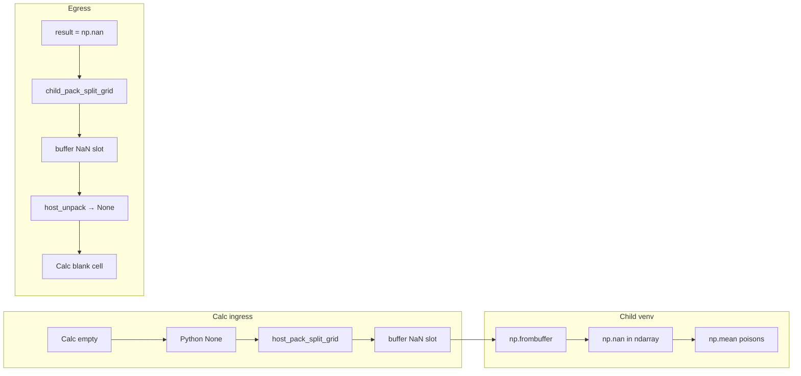
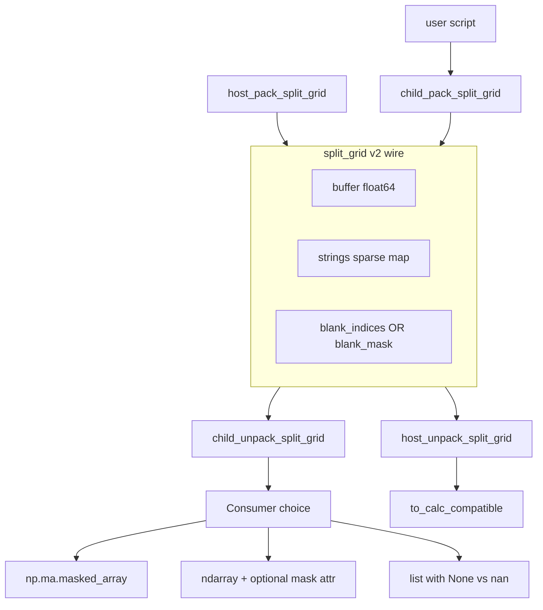

# Blank vs NaN in split_grid — research and implementation plan

## Notes — user-visible behavior (opinion, not locked)

These are implementation-agnostic UX notes on what the feature should accomplish for authors of `=PYTHON()` scripts and chat-run Python. Wire format and API choices below are still open.

### What users actually complain about

The main pain is **ingress**: a numeric range with one empty Calc cell becomes `np.nan` holes in `data`, so `np.mean(data)` returns `nan`, egress coerces that to a **silent blank cell** — no error, no number, hard to debug. The gotcha section in [`docs/enabling_numpy_in_libreoffice.md`](docs/enabling_numpy_in_libreoffice.md) already documents workarounds (`np.nanmean`); the feature should reduce the need for those in the common case.

### Semantic model (spreadsheet-first)

Treat two concepts differently:

| Concept | Origin | User mental model | Should behave like |
|---|---|---|---|
| **Blank** | Calc empty cell | “no value entered” | Calc **AVERAGE** skips it; cell stays empty on round-trip |
| **NaN** | Python/NumPy computation | “numeric operation failed / undefined” | May propagate or be shown explicitly — not the same as an empty input cell |

Calc never sends IEEE NaN on ingress — only empty cells (`None`). The ambiguity is introduced by the codec and hurts on the way back out.

### Ingress — what I think should improve

- **Priority #1.** Large pure-numeric ranges (split_grid path) should not require `np.nanmean` for the obvious `result = np.mean(data)` case when holes are **Calc blanks**, not computed NaNs.
- **Reasonable target:** blanks behave like **missing data** (spreadsheet empty), not like poison values. NumPy’s natural expression is a **masked array** (`data.mean()` ignores masked slots) rather than a raw float64 ndarray full of `np.nan`.
- **Mixed-type ranges** (any text): keep **`None` in nested lists** — already closer to spreadsheet semantics; less change, lower risk.
- **Small ranges** (< threshold, nested list wire): preserve **`None` vs `float('nan')`** if possible; today `_cell_for_json` collapses `nan → None` on that path — split_grid and list paths should eventually agree.
- **Do not try to fully emulate Calc `SUM` via one numpy call.** Calc SUM treats empty as 0; AVERAGE skips empty. NumPy has no single function that matches both. Document that **`np.nansum` ≠ SUM`**; optional sandbox helpers (`wa_sum`, `wa_average`) are fine but not a substitute for fixing the mean case.

### Egress — what I think should improve (lower priority)

- **Keep formula safety as the default.** Matrix results that write NaN into neighboring formula ranges should not suddenly start producing `#NUM!` / `#VALUE!` without an explicit author choice.
- **Blank / `None` / masked-out slots → empty cell** always — this matches spreadsheet expectations and today’s behavior.
- **Computed `np.nan` (no blank tag) → empty cell** is acceptable for **matrix slots** (status quo, formula-safe).
- **Scalar `result = float('nan')` → empty cell** is the confusing case today. A modest UX win worth considering: scalar computed NaN → visible **`"NaN"` text** (or documented opt-in), while matrix NaN slots stay blank. Not required to solve the mean problem; decide separately.
- **Round-trip:** if the script returns `data` unchanged, cells that were Calc-empty on the way in should still be **empty in the sheet**, not indistinguishable from computed NaN.

### Docs and LLM guidance (user-visible)

- Update [`docs/enabling_numpy_in_libreoffice.md`](docs/enabling_numpy_in_libreoffice.md) and [`docs/numpy-serialization.md`](docs/numpy-serialization.md): what type `data` is (ndarray vs masked array vs list), which aggregations “just work”, and what still needs explicit handling.
- If ingress materialization changes (e.g. masked array), update sandbox prefix / prompts in [`import_policy.py`](plugin/scripting/import_policy.py) so generated scripts use the right API.
- Retire or shorten the “silent blank from NaN poisoning” gotcha once ingress behavior is fixed; keep notes for edge cases (inf, intentional NaN display, SUM vs nansum).

### What I would not optimize for initially

- Round-tripping “real NaN” into Calc as `#NUM!` by default.
- Pandas nullable dtypes as the primary `data` representation.
- Breaking the `frombuffer` fast path for large numeric grids.

---

## Problem today

The production wire format (`split_grid` inside Pickle5) stores every numeric grid as a dense **float64 buffer** plus an optional sparse **`strings`** index map ([`docs/numpy-serialization.md`](docs/numpy-serialization.md), [`plugin/scripting/payload_codec.py`](plugin/scripting/payload_codec.py)).

| Cell meaning | `buffer` | `strings` | After child unpack (pure numeric) | After egress to Calc |
|---|---|---|---|---|
| Calc empty (`None`) | `NaN` | — | `np.nan` | `""` (blank) |
| Python/NumPy `NaN` | `NaN` | — | `np.nan` | `""` (blank) |
| Text | `NaN` | `{flat_idx: str}` | string in list path | text |

Both “missing” flavors share the same **NaN slot** in the buffer. That is intentional today ([`docs/enabling_numpy_in_libreoffice.md#empty-cells-vs-nan`](docs/enabling_numpy_in_libreoffice.md)) because:

- Pure numeric ingress needs a homogeneous float64 lane for **`np.frombuffer`** (the main performance win).
- Egress maps **all** NaN/`None` to empty cells via [`to_calc_compatible`](plugin/calc/python_function.py) to avoid `#NUM!` / `#VALUE!` in matrix blocks.

**User-visible pain:** on ingress, `np.mean(data)` is poisoned by holes that came from Calc blanks; on egress, a computed `nan` silently becomes a blank cell ([Gotcha section](docs/enabling_numpy_in_libreoffice.md)).

**Important nuance:** Calc ingress never delivers a native float NaN — empty UNO cells become Python `None` in [`calc_addin_data._unwrap_cell`](plugin/calc/calc_addin_data.py). The ambiguity appears only **after** materialization as `np.nan`, or on **egress** when Python returns `None` vs `float('nan')`.



---

## Can split_grid store the distinction efficiently?

**Yes.** The format already uses a **parallel side channel** for non-numeric data (`strings`). A second side channel for “blank/missing semantics” fits the same pattern and keeps the float64 fast path intact.

### Encoding options (ranked)

| Option | Wire shape | Size for N cells, B blanks | Lookup on unpack | Notes |
|---|---|---|---|---|
| **A. Dense bitmap** (`blank_mask: bytes`) | `(N + 7) // 8` bytes | 100k cells → **12.5 KiB** (~1.6% of 800 KiB buffer) | O(1) bit test; vectorized with `np.unpackbits` | Best when blanks are common or sparsity unknown |
| **B. Sparse index list** (`blank_indices: list[int]`) | 8×B bytes (Pickle5) | 1 blank in 10k → **8 B**; 90k blanks → **720 KiB** | O(B) or build bitmap once | Mirrors `strings`; wins for typical data tables |
| **C. Hybrid auto-pick** | A or B based on threshold | min(A, B) | Slightly more codec logic | e.g. use list when `B * 8 < (N+7)//8` |
| **D. Reuse `strings` with sentinel** | e.g. `{idx: ""}` or magic | Awful | Collides with real empty strings | **Not recommended** |
| **E. Separate buffer dtype / object lane** | object array or second buffer | Large; kills `frombuffer` path | — | **Defeats the purpose of split_grid** |

**Recommendation:** **Option C (hybrid)** with a simple rule:

- **`blank_indices`** when blank count is small (typical: a few holes in a numeric column).
- **`blank_mask`** packed bytes when blanks dominate (sparse sheets, mostly-empty ranges).
- When `B == 0`: emit **`blank_mask: b""`** (zero-length bitmap) — keeps unpack logic uniform with no dual-path fallback.

This parallels the existing design: dense numeric lane + sparse exceptions.

### Deployment constraint: no backward-compat dual path

Host (LO extension) and venv worker are **deployed together** (`make deploy`). There is no mixed-version window where an old worker must decode a new host payload or vice versa. That simplifies the codec:

- **Always emit** one of `blank_indices` or `blank_mask` from every `host_pack_split_grid` / `child_pack_split_grid` call (empty mask when no blanks).
- **Unpack always reads** blank metadata; no “absent field → legacy v1 semantics” branch.
- No wire version field or migration shim required (unless you want one for documentation clarity).
- `@deal` contracts can require blank fields on split_grid envelopes instead of treating them as optional.

### Updated split_grid envelope

Extend the dict in [`host_pack_split_grid`](plugin/scripting/payload_codec.py) — keep `__wa_payload__` tag; add required blank side channel:

```python
{
    "__wa_payload__": "split_grid",
    "dtype": "float64",
    "shape": [rows, cols],
    "column_kinds": ["int", "float", ...],
    "buffer": b"...",           # unchanged: NaN = non-numeric or missing slot
    "strings": {7: "banana"},    # unchanged
    # NEW (required — one of these, never both):
    "blank_indices": [2, 5, 19],   # when sparse wins
    # OR
    "blank_mask": b"\x00\xA0...",  # np.packbits(row-major), len = ceil(n_cells/8); b"" when B==0
}
```

**Invariants:**

- Blank bit/set membership means **“Calc-style blank / missing-for-stats”**; buffer may still be `NaN` at those indices.
- Buffer NaN **without** blank bit = **computed NaN** (Python/NumPy semantic).
- **`strings` indices and blank indices are disjoint** in normal packing (text cells are not blank).
- Pickle5 cost for 12 KiB bitmap is negligible vs buffer ([benchmarks](docs/numpy-serialization.md#benchmark-results-2026-05): dump/load ≈ 0.003 ms even at 100k cells).

---

## Where metadata would be set and consumed

Pack/unpack touchpoints (all in [`plugin/scripting/payload_codec.py`](plugin/scripting/payload_codec.py) unless noted):

| Stage | Function | Change |
|---|---|---|
| Host ingress pack | `_flatten_grid_to_components` / `host_pack_split_grid` | Already tracks `column_has_none[c]` per column; extend to **per-cell blank bit** when `val is None`. Also distinguish `float('nan')` in nested-list path if ever present. |
| Cython fast path | [`native/writeragent_vec/pack.pyx`](native/writeragent_vec/pack.pyx) | Same blank-bit logic in `_flatten_cell` (today sets `column_has_none` on `None`). |
| Child ingress unpack | `child_unpack_split_grid` | After `frombuffer`, apply blank metadata (see consumer options below). |
| Child egress pack | `child_pack_split_grid` | Read blank bits from **`np.ma.masked_array` mask**, or from list `None` vs `nan` when packing lists back to split_grid. |
| Host egress unpack | `host_unpack_split_grid` | Use blank bit to choose `None` vs leave `float('nan')` in nested lists. |
| Calc write | [`to_calc_compatible`](plugin/calc/python_function.py) | Policy-dependent: blank bit → `""`; bare NaN without bit → `""` (today) or `#NUM!` / `"NaN"` (future). |

Smaller grids (`< BINARY_MIN_CELLS`) stay on nested Pickle lists — they **already distinguish** `None` vs `float('nan')` via [`_cell_for_json`](plugin/scripting/payload_codec.py) (`nan → None` on JSON path only). Any v2 policy should **align** split_grid behavior with list behavior for parity ([`tests/scripting/test_serialization_ab.py`](tests/scripting/test_serialization_ab.py)).



---

## Consumer-side choices (policy — not decided yet)

The wire format **enables** these; you can adopt one or combine later.

### Ingress — make stats spreadsheet-like

| Approach | Needs blank metadata? | `np.mean(data)` without user change? |
|---|---|---|
| Status quo + docs (`np.nanmean`) | No | No |
| Unpack to **`np.ma.masked_array`** (mask from blank bits) | Yes | **`data.mean()`** yes; bare **`np.mean(data)`** still wrong — document `.mean()` or provide `wa_mean()` helper |
| Unpack to ndarray but inject **`data = np.ma.masked_invalid(...)`** with mask only on blank bits | Yes | Same as above |
| Auto-wrap in pandas with nullable NA | Yes + dependency | Different API |

**Spreadsheet alignment:** Calc `AVERAGE` skips empty cells; `SUM` treats empty as 0. NumPy has no single equivalent — **`np.nansum` ≠ SUM** (nansum skips NaN but sum treats empty as 0 in Calc). Blank metadata lets you build **`wa_average`** that matches Calc if desired.

### Egress — show computed NaN vs intentional blank

| Policy | blank bit set | buffer NaN, no blank bit |
|---|---|---|
| Today | `""` | `""` |
| Strict display | `""` | leave as IEEE NaN → Calc `#NUM!` or stringify `"NaN"` |
| Excel-like | `""` | `"NaN"` text (visible, no formula poison) |

Requires **`child_pack_split_grid`** to tag `None`/masked slots with blank bit and leave raw `np.nan` untagged.

---

## Implementation phases (when you choose to proceed)

### Phase 0 — Design gate (no code)

- Pick ingress policy, egress policy, or both.
- Decide hybrid threshold (e.g. `B * 8 < (N+7)//8 → indices else bitmap`).

### Phase 1 — Wire codec (minimal, test-first)

- Add blank tracking to `_flatten_grid_to_components` (stdlib + Cython).
- Add **required** `blank_indices` / `blank_mask` to envelope; helpers `_blank_bits_from_envelope`, `_envelope_set_blank`, `_choose_blank_encoding`.
- Update `@deal` contracts to require blank fields; update [`tests/scripting/test_payload_codec.py`](tests/scripting/test_payload_codec.py) and legacy test helpers that construct split_grid envelopes by hand.
- Extend [`tests/scripting/test_serialization_ab.py`](tests/scripting/test_serialization_ab.py) with blank/nan oracles **once policy is chosen** (replace today’s collapsed parity where appropriate).

### Phase 2 — Consumer behavior (policy-specific)

- `child_unpack_split_grid`: materialize mask (likely `np.ma.masked_array` for pure numeric + blanks).
- `child_pack_split_grid` / list pack path: encode blank bits on egress.
- `host_unpack_split_grid` + `to_calc_compatible`: apply egress policy.

### Phase 3 — Docs and author guidance

- Update [`docs/enabling_numpy_in_libreoffice.md`](docs/enabling_numpy_in_libreoffice.md) and [`docs/numpy-serialization.md`](docs/numpy-serialization.md) encoding table.
- Adjust LLM/sandbox prompts in [`import_policy.py`](plugin/scripting/import_policy.py) if `data` type changes (e.g. masked array).

### Phase 4 — Benchmark regression

- Re-run [`scripts/bench_serialization.py`](scripts/bench_serialization.py) with blank-heavy fixtures; expect pack loop + small wire bump, **frombuffer path unchanged**.

---

## Alternatives that avoid wire-format change

| Alternative | Pros | Cons |
|---|---|---|
| Documentation only (`np.nanmean`, gotcha section) | Zero cost | Does not fix silent egress blank |
| Auto-coerce `data` to masked array in worker inject ([`venv_sandbox.send_variables`](plugin/scripting/venv_sandbox.py)) without persisting on wire | Helps ingress only; no envelope change | Loses distinction after user copies/reassigns; egress unchanged |
| Return helper API (`wa_mean`, `wa_nansum`) in sandbox prefix | Simple UX | Not automatic; doesn’t fix egress |
| Always use nested lists (disable split_grid for ranges with blanks) | Preserves `None` vs `nan` in Python lists | Destroys performance on large numeric grids |

**Conclusion:** if the goal is **correctness at scale** (≥10 cells, split_grid path), a **parallel blank side channel** is the efficient, architecturally consistent fix. If the goal is **author education only**, docs suffice.

---

## Risk notes

- **No backward-compat burden:** simultaneous deploy means pack and unpack can be updated atomically; remove legacy “NaN slot = ambiguous” branches rather than keeping fallbacks.
- **Formal verification:** split_grid is Tier-0 ([`docs/serialization-verification-plan.md`](docs/serialization-verification-plan.md)); new required fields need CrossHair/deal contract updates and fixture updates in [`payload_codec_test_support.py`](tests/scripting/payload_codec_test_support.py).
- **Multi-range:** [`PAYLOAD_MULTI_DATA`](plugin/scripting/payload_codec.py) wraps multiple split_grid items — blank metadata is per-item, no change to outer envelope.
- **Chat tool / MCP paths** using the same codec inherit behavior automatically ([`venv_python.py`](plugin/calc/venv_python.py)).
- **Do not** store blank state only in `column_has_none` — it is column-level and already discarded; insufficient for per-cell semantics.
- **Benchmark harness:** [`scripts/bench_serialization.py`](scripts/bench_serialization.py) and legacy b64 helpers construct envelopes manually — update in same change set so benches stay valid.

