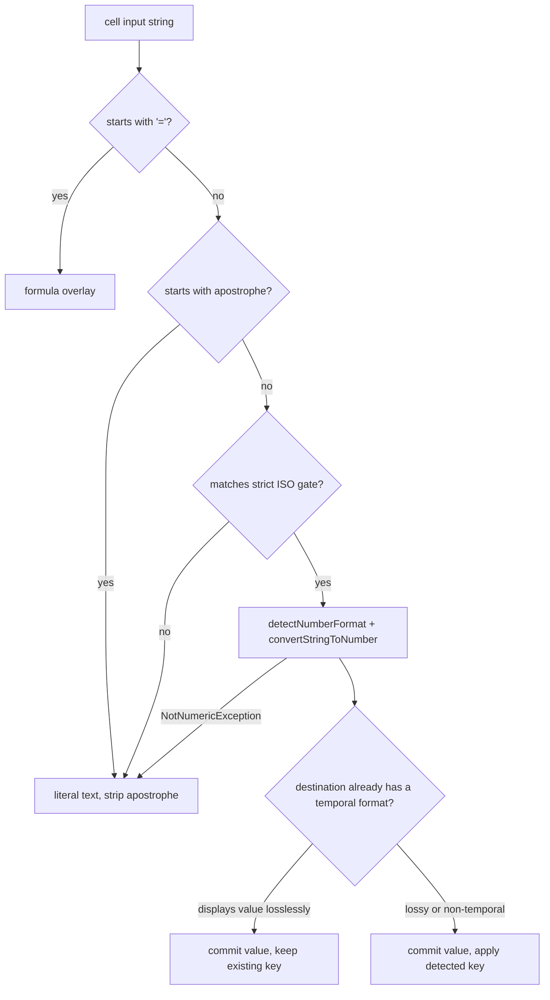

# Date and Time Lifecycle in LibreOffice Calc

**Current behavior, target wire contract, and implementation plan**

This document separates what WriterAgent ships today from the proposed Calc write behavior. It covers PyUNO cell values, read-path format enrichment, MCP clock context, and the planned conversion of date/time strings into Calc serial values.

> **Status:** MCP clock context and read enrichment are implemented. ISO-shaped write ingestion is not implemented. Sections marked **Target** describe future behavior, not the current API.

> **Every LibreOffice behavior claim in this document was measured**, not assumed. See [§8 Measured behavior](#8-measured-behavior-libreoffice-26252). Two earlier design assumptions turned out to be wrong, and one shipping bug was found. Re-run the probes before trusting any claim here on a new LibreOffice major version.

---

## 1. Context & Problem Statement

### 1.1 The Calc Date/Time Storage Model

Calc's **PyUNO cell API** operationally represents constant dates, times, and datetimes as numeric values. This does not mean that file formats lack typed date/time values: ODF has `office:value-type="date"` / `"time"` with `office:date-value` / `office:time-value`, and SpreadsheetML also supports typed ISO dates. This plan concerns Calc's runtime cell API, not the on-disk representation.

1. **Cell content type**: A constant date/time cell is `com.sun.star.table.CellContentType.VALUE`; a formula that evaluates to a date/time remains `FORMULA`. Text that resembles a date remains `TEXT`.
2. **Epoch serial representation**: Runtime values are floating-point day counts relative to the document's `NullDate` (the common Calc default is `1899-12-30`).
   - `46239.0` represents `2026-08-05`.
   - `0.3333333333333333` represents `08:00:00` (8 hours / 24 hours).
   - `46240.5` represents `2026-08-06 12:00:00`.
3. **Display formatting**: Presentation (`2026-08-05`, `08/05/2026`, or `46239`) comes from the cell's `NumberFormat` key in the document's `XNumberFormats` registry.

`format_category` therefore describes the **number format**, not an intrinsic cell data type. An arbitrary number can be date-formatted.

#### Glossary

Used interchangeably elsewhere; fixed here. **Serial** (or *day serial*, *serial double*) is the floating-point day count relative to `NullDate`. **Category** is one of `date` / `time` / `datetime`, derived from the number format's `Type` bitmask, never from the cell content type. **Format key** is the integer index into the document's `XNumberFormats` registry.

#### Durations are not a separate category in practice

Earlier revisions of this document claimed that `NumberFormat.DURATION` (8196) is excluded from the enrichment contract, and treated that as protection for elapsed-time columns. **That protection does not exist.** Measured on LibreOffice 26.2.5.2, every elapsed-time format reports `Type` = `TIME` (4) or `DEFINED|TIME` (5), never 8196:

| Format code | `Type` | `_format_category_from_type` |
| :--- | :--- | :--- |
| `[HH]:MM:SS` (also built-in formatindex 43) | 4 | `"time"` |
| `[H]:MM` | 5 | `"time"` |
| `[MM]:SS` | 5 | `"time"` |
| `HH:MM:SS` | 4 | `"time"` |

Consequence, verified end to end: a cell holding `1.25` under `[HH]:MM:SS` displays `30:00:00`, but `read_cell_range` reports `"iso8601": "06:00:00"`. The whole day is silently dropped by `.time()` in `_iso8601_from_serial` ([plugin/calc/inspector.py](../plugin/calc/inspector.py)). This is a **live read-path bug**, independent of the write work — see [§3.3](#33-known-read-path-bug-elapsed-times-over-24-hours).

### 1.2 The LLM Friction Points

- **Read Path Friction**: When an LLM reads a spreadsheet via raw `read_cell_range`, receiving `value: 46239.0` without context leaves the model unable to determine if the cell represents currency, a raw quantity, or a date.
- **Write Path Friction**: When an LLM generates data to write (e.g. `["2026-08-08", "08:00"]`), standard string assignment puts literal text (`com.sun.star.table.CellContentType.TEXT`) into the cell. This breaks spreadsheet formulas (e.g. `=A26+1`), numeric sorting, and native Calc filtering.

---

## 2. Lifecycle Architecture

The end-to-end date/time architecture consists of three synchronized phases:

```
┌────────────────────────────────────────────────────────────────────────────────┐
│                         A. MCP & PROMPT CONTEXT                                │
│  Injects the local clock into initialization instructions and tool guidance    │
└───────────────────────┬────────────────────────────────────────────────────────┘
                        │
                        ▼
┌────────────────────────────────────────────────────────────────────────────────┐
│                         B. READ PATH ENRICHMENT                                │
│  detects NumberFormat category ──► converts serial double ──► outputs iso8601   │
└───────────────────────┬────────────────────────────────────────────────────────┘
                        │
                        ▼
┌────────────────────────────────────────────────────────────────────────────────┐
│                         C. WRITE PATH INGESTION                                │
│  gates ISO string ──► Calc detects format + value ──► applies key if needed    │
└────────────────────────────────────────────────────────────────────────────────┘
```

**Implementation status:**

- Area A: MCP clock context is **implemented**; write-tool ISO guidance is not.
- Area B: read enrichment with `iso8601` + `format_category` is **implemented**, with the duration bug in §3.3 outstanding.
- Area C: ISO string → serial + `NumberFormat` is **planned**. Blocked on the Table B sign-off in [§5.1](#51-decision-ledger).
- Symmetric LLM read (`value` = ISO string) is a **future follow-up** (§3.2); ship write against today's read shape first.

---

## 3. Read Path (Implemented)

*Status: Implemented in commit [`2650d3b`](https://github.com/KeithCu/writeragent/commit/2650d3bbc39f2c3ab29102d8d50208ea1e817656)*

### 3.1 Mechanism

When `read_cell_range` is invoked with `include_format_info=True` (enabled by default for LLM tool invocations):

1. **Pre-flight Check**: To prevent performance degradation on large datasets, `CellInspector._range_format_rows()` scans the range for cell formats. If no date/time formats or formulas exist in the target block, format inspection returns early.
2. **Format grouping**: Queries `cell_range.getUniqueCellFormatRanges()` to group cells sharing a format. The response still requires an $O(N \times M)$ serialization walk, but format-related UNO round-trips scale with format groups rather than cells.
3. **Format classification**: Reads `getByKey(format_id).getPropertyValue("Type")`, masks `NumberFormat.DEFINED`, and classifies:
   - `NUMBER_FORMAT_DATE` $\rightarrow$ `"date"`
   - `NUMBER_FORMAT_TIME` $\rightarrow$ `"time"`
   - `NUMBER_FORMAT_DATE | NUMBER_FORMAT_TIME` $\rightarrow$ `"datetime"`
4. **Serial-to-ISO translation**:
   Reads `NullDate` from `doc.getNumberFormatSettings().getPropertyValue("NullDate")` and computes:
   $$\text{timestamp} = \text{NullDate} + \text{timedelta}(\text{seconds} = \text{round}(\text{serial\_value} \times 86400))$$
   Outputs formatted ISO string (`iso8601`) and `format_category`. Helpers live in [plugin/calc/inspector.py](../plugin/calc/inspector.py).

### 3.2 Current Wire Shape vs Future Symmetry

#### Current design (shipped; matches UNO tests)

`read_cell_range` returns the raw Calc serial double as `value` and appends `iso8601` + `format_category`:

```json
{
  "address": "A20",
  "value": 46239.0,
  "formula": null,
  "type": "value",
  "iso8601": "2026-08-05",
  "format_category": "date"
}
```

Internal callers use `CellInspector.read_range(include_format_info=False)` and get un-enriched raw float serials (NumPy, `=PY`, analysis).

#### Future symmetry (not implemented — do after write path)

Returning `value: 46239.0` reflects `CellContentType.VALUE` but creates LLM friction:

1. **Transformation loops**: read → edit → write often reuses `row["value"]`, so serials bounce back into `write_formula_range`.
2. **Model reasoning**: LLMs prefer ISO strings (`"2026-08-05"`) and must reconcile `value` vs `iso8601`.

A later change can put ISO in `value` and set `type` to `"date"` / `"time"` / `"datetime"`, omitting the raw serial from the LLM payload:

```json
[
  {"address": "A20", "value": "2026-08-05", "formula": null, "type": "date", "format_category": "date"},
  {"address": "B20", "value": "08:00:00", "formula": null, "type": "time", "format_category": "time"}
]
```

After Area C ships, **write will accept the subset in §5.3** while **read still exposes serial + `iso8601`**. Do not flip the read shape in the same change as the write path.

> **Invariant**: Internal PyUNO / analysis callers (`include_format_info=False`) remain un-enriched for NumPy and computational pipelines.

### 3.3 Known read-path bug: elapsed times over 24 hours

Because elapsed formats classify as `"time"` (§1.1), `_iso8601_from_serial` routes them through `.time()`, which discards whole days:

| Cell value | Format | Calc displays | `iso8601` reported | Correct? |
| :--- | :--- | :--- | :--- | :--- |
| `1.25` | `[HH]:MM:SS` | `30:00:00` | `06:00:00` | No |
| `0.333…` | `[HH]:MM:SS` | `08:00:00` | `08:00:00` | Yes |

The existing comment at [plugin/calc/inspector.py](../plugin/calc/inspector.py) anticipates the ambiguity but the guard was written against `NumberFormat.DURATION`, which never fires. Options, in preference order:

1. Detect elapsed formats by inspecting the `FormatString` for a bracketed leading element (`[H`, `[HH`, `[MM`, `[SS`), and omit `iso8601` for those cells (keeping `format_category` absent as originally intended).
2. Emit an ISO 8601 duration (`PT30H`) under a distinct key, which is a wire-contract change.
3. Emit `iso8601` only when the serial is below `1.0`.

Recommend option 1: it restores the documented intent with a single string check and no contract change. Fix separately from Area C.

---

## 4. Prompting and Context (Partly Implemented)

### 4.1 Connection-Time Clock Context

[plugin/mcp/mcp_protocol.py](../plugin/mcp/mcp_protocol.py) injects current local clock context into MCP system instructions:

```python
def _format_mcp_clock_context(now: datetime.datetime | None = None) -> str:
    local_now = now.astimezone() if now is not None else datetime.datetime.now().astimezone()
    timezone_name = local_now.tzname()
    timezone_suffix = f" ({timezone_name})" if timezone_name else ""
    return f"Current local date and time: {local_now.strftime('%A')}, {local_now.isoformat(timespec='seconds')}{timezone_suffix}."
```

Example string prepended to system instructions:
`Current local date and time: Friday, 2026-08-07T11:04:25-04:00 (EDT).`

**Policy (resolved):** Calc serials are timezone-less, and offset-bearing strings such as `2026-08-08T08:00:00-04:00` stay literal text. This costs nothing to enforce — Calc's own scanner rejects both `Z` and numeric offsets in every locale tested (§8). The remaining hazard is that the clock context prints exactly the shape we reject, so the write-tool description must tell the model to drop the offset.

The previously "unresolved" alternative — preserve wall-clock fields and discard the offset — is **rejected for v1**. It is lossy in a way the cell cannot record, and converting to a document-local time is not reliable without a document timezone and DST rules. Revisit only with a stored document timezone.

### 4.2 Tool Schema Definitions

- **`ReadCellRange`** (`read_cell_range` in [plugin/calc/cells.py](../plugin/calc/cells.py)): already documents `iso8601` / `format_category`. Add a write-back hint (see D12).
- **`WriteCellRange`** (`write_formula_range`): **does not yet** mention date/time strings.

Proposed description text, to be reviewed for accuracy and token cost before it ships. Tool descriptions are paid for on every request, so the wording is part of the contract, not a comment:

> Dates and times: use ISO 8601 only — `YYYY-MM-DD`, `HH:MM[:SS]`, or `YYYY-MM-DDTHH:MM[:SS]`. These become real Calc date/time values. Do not include a timezone offset or `Z`, and do not use locale forms like `08/05/2026`; those are stored as text. Prefix with an apostrophe (`'2026-08-08`) to force text.

Do not broaden write parsing to locale display forms. §8 shows `08/05/2026` resolves to **2026-08-05** under `en-US` but **2026-05-08** under `fr-FR`.

---

## 5. Write Path (Target)

*Implementation plan — not yet in code*

The first implementation applies only to the public `write_formula_range` path in [plugin/calc/manipulator.py](../plugin/calc/manipulator.py), which is the sole cell-writing entry point for this tool.

### 5.1 Decision Ledger

#### Table A — Settled (build against these; no sign-off needed)

| ID | Decision |
| :--- | :--- |
| S1 | Read path keeps serial `value` + `iso8601`. Do not flip it in this change. |
| S2 | A leading `=` routes to the formula path and never reaches the date gate. |
| S3 | The accepted grammar (§5.3) is the wire contract; it is a gate, not a parser. |
| S4 | Anything the gate rejects is written as literal text. |
| S5 | `include_format_info=False` callers stay un-enriched. |
| S6 | Time-only serials are independent of `NullDate`. |
| S7 | Never pass ASCII format codes such as `"YYYY-MM-DD"` to `queryKey` for defaults (§6). |
| S8 | Batch the value commit; apply formats per contiguous block, never per cell in a loop. |
| S9 | The mixed-formula commit fix (§5.5 step 2) merges independently of the feature. |
| S10 | Scope is `write_formula_range` only. `=PY` spill, `spreadsheet_import/preserve.py`, `insert_cell_html`, and `editselection` keep current semantics, because they carry real Python types or source-file formats. |
| S11 | Tests split unit and UNO per [AGENTS.md](../AGENTS.md). |
| S12 | Fractional seconds, leap seconds, `24:00`, durations-as-input, and locale display forms stay out of scope. |
| S13 | Inspect destination formats only when at least one value passed the gate. |

#### Table B — Open decisions (need sign-off)

"Reversible" marks decisions that are cheap to change later. Format application mutates the user's saved file and is effectively a one-way door; return-message wording is free.

| ID | Situation | Recommendation | Reversible | Status |
| :--- | :--- | :--- | :--- | :--- |
| D1 | Destination format category differs from the value's | Replace "same category" with **"preserve when the existing format displays the value without loss"** | No | Measured: a date-formatted cell given `08:00` displays `1899-12-30` |
| D2 | Datetime at exactly midnight into a date cell | Preserve the date format | No | Open |
| D3 | Date into a datetime cell | Preserve; a date is midnight | No | Open |
| D4 | Time into an elapsed-time cell (`[HH]:MM`) | Preserve. These report `Type` 4, so a naive "non-temporal formats get replaced" rule would **not** clobber them — but a "same category" rule would treat them as ordinary times | No | Resolved by §1.1 measurement |
| D5 | ISO string into a Text (`@`) cell | Calc converts it anyway and renders `46242`. Either apply a temporal format or skip the cell entirely; doing nothing is the one option that is definitely wrong | No | Measured: `@` does **not** block conversion via the API |
| D6 | Escape hatch | Leading apostrophe (`'2026-08-08`). It is the only mechanism that works; note that it also sets the cell format to `@` | Yes | Measured |
| D7 | Near-miss strings the model emits | Keep the gate strict; optionally admit unpadded `2026-8-8`, which is unambiguous in every locale tested | Yes | Measured (§8) |
| D8 | Offset and `Z` datetimes | Text. Free — Calc rejects them everywhere. Add the tool wording in §4.2 | Yes | Resolved |
| D9 | Bare `08:00` | Always a clock serial below `1.0`; never impute today's date from clock context | No | Open |
| D10 | Partial coercion inside one range | Per-cell, plus a coercion summary in the return message | Yes | Open |
| D11 | Range bounds | Largely dissolves: `NotNumericException` and Calc's own limits handle it. State the supported window | Yes | Resolved by design choice |
| D12 | LLM echoes `value: 46239.0` back | Accept for v1; add a write-back hint to the `read_cell_range` description | Yes | Open |
| D13 | Formula cells in a coerced range | No format application for formulas in v1 | Yes | Open |
| D14 | Empty cells inside a coerced block | Include them so the column stays uniform | Yes | Open |
| D16 | `set_style(number_format=…)` collision | Route date/time cases through the same helper; fixes the ASCII `queryKey` bug at [plugin/calc/manipulator.py](../plugin/calc/manipulator.py) | Yes | Open |
| D17 | Which format key to apply for times | `detectNumberFormat` returns the **locale-preferred** key, which for `en-US` is `HH:MM:SS AM/PM`, not ISO. Dates detect as ISO in every locale; times do not | No | New; see §6.2 |
| D18 | Locale selection for unformatted cells | **Dissolved.** Locale becomes an explicit argument to `detectNumberFormat`, not an ambient document property | — | Resolved |
| D19 | Text fallback clobbers the destination format | `setDataArray` with a number-like string forces `@` onto the cell, stripping a date column's format. Decide: restore the prior key, accept it, or route text differently | No | New; pre-existing behavior, not caused by this feature |

### 5.2 Design: three candidates, one recommendation

The measurements in §8 change which implementation is cheapest. All three keep the same strict wire contract; they differ in who computes the serial and who chooses the format key.

| | A. Hand-rolled | B. `setFormula` router | C. `XNumberFormatter` (recommended) |
| :--- | :--- | :--- | :--- |
| Parse | Our regex + `datetime` | Calc | Calc |
| Epoch / `NullDate` | Our arithmetic | Calc | Calc |
| Format key | `getFormatIndex` + compose | **Not applied at all** | Calc returns it |
| Localized format letters | Must hand-build (§6.1) | n/a | Automatic |
| Locale control | Ambient (D18) | Ambient | Explicit argument |
| Round trip through `read_cell_range` | Works | **Broken** | Works |

Candidate B is disqualified on its own: `setFormula` converts the value but leaves the cell **General**, so the cell displays `46242` and `read_cell_range` returns no `iso8601` at all (§8, Q3).

**Candidate C** is the recommendation. Per parsed cell:

```python
# formatter: com.sun.star.util.NumberFormatter, attached to the document's
# XNumberFormatsSupplier once per invocation.
# std_key: formats.getStandardIndex(locale) — the locale is now explicit, which is
# what dissolves D18. Calc parses in the locale of the key you hand it.
try:
    detected_key = formatter.detectNumberFormat(std_key, text)
    value = formatter.convertStringToNumber(std_key, text)
except NotNumericException:
    ...  # literal text fallback
```

`detected_key` already carries the correct localized format code — `YYYY-MM-DD` under `en-US`, `JJJJ-MM-TT` under `de-DE`, `AAAA-MM-JJ` under `fr-FR` — which is precisely what §6.1 warns is unsafe to hand-build.

#### The gate stays mandatory

Delegating parsing does **not** mean delegating the contract. Calc's scanner is far more permissive than our wire subset and is locale-dependent for exactly the forms we must reject:



Without the gate, `08/05/2026` becomes 5 August under `en-US` and 8 May under `fr-FR`, and `30:00` silently becomes `1.25`.

### 5.3 Accepted grammar (the gate)

- Date: `YYYY-MM-DD`
- Time: `HH:MM` or `HH:MM:SS`
- Datetime: `YYYY-MM-DDTHH:MM[:SS]`
- Compatibility datetime: one space may replace `T`
- Leading/trailing whitespace may be stripped

Fast prefilter before regex:

```python
if not any(c in val for c in ("-", ":")):
    return None  # Skip regexes for plain text, numbers, and prose
```

```python
_DATE_RE = re.compile(r"^(\d{4})-(0[1-9]|1[0-2])-(0[1-9]|[12]\d|3[01])$")
_TIME_RE = re.compile(r"^([01]\d|2[0-3]):([0-5]\d)(?::([0-5]\d))?$")
_DATETIME_RE = re.compile(
    r"^(\d{4})-(0[1-9]|1[0-2])-(0[1-9]|[12]\d|3[01])[T ]"
    r"([01]\d|2[0-3]):([0-5]\d)(?::([0-5]\d))?$"
)
```

Under Candidate C these are a **shape filter only**. Calendar validity, epoch arithmetic, and format selection all belong to Calc. `2026-02-30` passes the regex and then fails `detectNumberFormat`, which is the intended fallback to text.

What the gate deliberately rejects, and what Calc would otherwise do with it (§8):

| Input | Calc would produce | Gate verdict |
| :--- | :--- | :--- |
| `2026-8-8` | date, identical in all locales | Text (D7: candidate for admission) |
| `08/05/2026` | `en-US` 5 Aug, `fr-FR` 8 May, `de-DE` text | Text |
| `05.08.2026` | `de-DE`/`fr-FR` date, `en-US` text | Text |
| `08:00 AM` | `en-US`/`fr-FR` time, else text | Text |
| `08:00:00.500` | time with fractional seconds | Text |
| `24:00` | `1.0` | Text |
| `30:00` | `1.25` | Text |
| `2026-08-08T08:00:00Z` | text in every locale | Text |

### 5.4 Execution Workflow in `CellManipulator.write_formula_range`

**Critical:** today's code, when any cell in the range is a formula, commits the **entire** range via `setFormulaArray` of stringified inputs and ignores `data_array`. The defect is not that native types break — numbers survive — it is that the two commit paths disagree on both type and format for the same input string:

| Same input `"2026-08-08"` | Result |
| :--- | :--- |
| via `setDataArray` (formula-free range) | `TEXT`, and the cell's format is rewritten to `@` |
| via `setFormulaArray` (mixed range) | `VALUE` `46242.0`, format left `General` |

So date handling **already** differs today depending on whether the range happens to contain a formula. Fix the commit path first (§5.5 step 2).

1. **Resolve document context once**: the formatter, `getStandardIndex(locale)`, and `NullDate` (still needed for read-side symmetry and diagnostics).
2. **Classify each input**: `=` prefix → formula overlay; apostrophe → text; gate match → temporal candidate; else `float()` → number; else text.
3. **Convert temporal candidates** via `detectNumberFormat` / `convertStringToNumber`, recording `(value, detected_key)`. On `NotNumericException`, demote to text.
4. **Commit values** with one `setDataArray`, leaving formula cells empty.
5. **Overlay formulas** with `setFormula` per recorded cell. Never send ISO strings through `setFormulaArray`.
6. **Apply formats** per contiguous block, skipping cells whose existing format already displays the value losslessly (D1). Cache keys per category for the invocation.

#### Failure modes and partial writes

`write_formula_range` currently wraps everything in one `try` / `except` that raises `ToolExecutionError`. If step 4 succeeds and step 6 throws, the serials are committed and rendering as raw numbers while the tool reports failure. Decide explicitly:

- Recommended: the format pass is **best-effort**. Log the exception and return `wrote values; could not apply date formats`, because the values are the user-visible payload and a failed cosmetic pass should not look like a failed write.
- `WriteCellRange.execute` in [plugin/calc/cells.py](../plugin/calc/cells.py) already opens `WriterCompoundUndo`, so all steps collapse into one undo entry **only if** the format pass lives inside `write_formula_range`. The scripting API path in [plugin/scripting/writeragent_api.py](../plugin/scripting/writeragent_api.py) has no compound undo.

#### Coercion report (D10)

Return what actually happened, so the model can self-correct without a second read:

```
Range A1:A12 filled with 12 values (10 dates, 2 text).
```

This is the only signal the model gets that `2026-08-08T08:00:00Z` silently became text.

#### Worked example

Input `["2026-08-08", "08:00", "08/05/2026", "=A1+1"]` into `A1:D1`, all cells General, `en-US`:

| Cell | Committed as | Format key applied | Displays | `read_cell_range` returns |
| :--- | :--- | :--- | :--- | :--- |
| A1 | `46242.0` | detected date | `2026-08-08` | `iso8601: "2026-08-08"`, `format_category: "date"` |
| B1 | `0.3333…` | detected time | `08:00:00 AM` (see D17) | `iso8601: "08:00:00"`, `format_category: "time"` |
| C1 | text `08/05/2026` | none; format becomes `@` (D19) | `08/05/2026` | no `iso8601` |
| D1 | formula | Calc propagates from A1 | `2026-08-09` | `iso8601: "2026-08-09"` |

Return message: `Range A1:D1 filled with 4 values (2 dates, 1 text, 1 formula).`

### 5.5 Merge-Safe Implementation Sequence

1. **Read-path duration fix** (§3.3). Independent, small, and fixes a shipping bug.
2. **Mixed-formula commit correction.** Change `write_formula_range` to commit `data_array` first and overlay formulas. Add regression coverage proving a formula-free range and a mixed range now treat the same input identically.
3. **Complete user-visible feature.** Gate, `detectNumberFormat` conversion, format policy per D1, tool-schema guidance, coercion report, and UNO write/readback tests together. Do not merge a state that writes serials without usable number formats — that is exactly Candidate B's failure.

### 5.6 Performance rules

1. $O(1)$ char guard before regex (§5.3).
2. Never set `NumberFormat` per cell in a loop. Homogeneous ranges get one range set; sparse grids coalesce into contiguous same-category blocks.
3. Cache the formatter, the standard key, and resolved format keys per category for the invocation.
4. Only inspect destination formats when at least one value passed the gate (S13).

A homogeneous write should cost roughly: one formatter setup, one `getStandardIndex`, two calls per distinct input string, one `setDataArray`, and one format-block set. Sparse mixed grids scale with formula overlays and block count. These are design targets, not guarantees.

### 5.7 Follow-ups (out of scope)

- Symmetric LLM read (`value` = ISO) — §3.2.
- Locale-display write parsing.
- Fractional seconds, offsets/timezones, `24:00`, leap seconds, and durations as input.
- Changing NumPy / `include_format_info=False` raw serial behavior.
- `=PY` spill coercion, NumPy `datetime64` epoch conversion, and spreadsheet-import epoch cleanup.

---

## 6. Locale and Number Formats

### 6.1 Why format codes cannot be hardcoded

Format code letters are localized. Passing raw ASCII codes like `"YYYY-MM-DD"` to `XNumberFormats.queryKey()` can fail or silently create an unintended custom format:

- **German (`de-DE`)**: `JJJJ-MM-TT`
- **French (`fr-FR`)**: `AAAA-MM-JJ`
- **Swedish (`sv-SE`)**: `YYYY-MM-DD` for dates, but `TT:MM:SS` for times

These are not hypothetical; they are the exact strings `detectNumberFormat` returned in §8.

### 6.2 Candidate C removes the problem

`detectNumberFormat` hands back a key that already carries the right localized code, so there is nothing to compose and nothing to guess:

| Input | `en-US` | `de-DE` | `fr-FR` | `sv-SE` |
| :--- | :--- | :--- | :--- | :--- |
| `2026-08-08` | `YYYY-MM-DD` | `JJJJ-MM-TT` | `AAAA-MM-JJ` | `YYYY-MM-DD` |
| `08:00` | `HH:MM:SS AM/PM` | `HH:MM:SS` | `HH:MM:SS` | `TT:MM:SS` |
| `2026-08-08T08:00:00` | `YYYY-MM-DD"T"HH:MM:SS` | `JJJJ-MM-TT"T"HH:MM:SS` | `AAAA-MM-JJ"T"HH:MM:SS` | `YYYY-MM-DD"T"TT:MM:SS` |

In all cases the production classifier `_format_category_from_type` returns the expected `date` / `time` / `datetime`, so the read path round-trips.

**D17 is the one wrinkle.** Dates detect as ISO everywhere, but `en-US` times detect as `HH:MM:SS AM/PM`. If the goal is ISO-looking display, override the time category with `NumberFormatIndex.TIME_HHMMSS` via `getFormatIndex`; if the goal is "what a local user expects," take the detected key. Recommend taking the detected key and documenting it, since the wire contract is already locale-independent regardless of display.

### 6.3 If Candidate A is chosen instead

Retain the previous approach: resolve `DATE_DIN_YYYYMMDD` (formatindex 33) and `TIME_HHMMSS` via `getFormatIndex`, and compose the datetime pattern from the two built-ins' `FormatString`. Measured: `getFormatIndex(33, en-US)` does return a key whose `FormatString` is `YYYY-MM-DD`. This path also reopens D18, since it needs a document-level locale for unformatted cells.

### 6.4 Locale-Independent Wire Contract

1. **Read**: `_iso8601_from_serial()` emits ISO 8601, locale-independent.
2. **Write**: the gate accepts only the locale-independent subset in §5.3.
3. **Display**: whatever key Calc detects for that locale. Display is deliberately not part of the contract.

---

## 7. Testing Strategy & Verification Plan

### 7.1 Unit Tests (`tests/calc/test_datetime_serial.py`)

The gate is pure and belongs in pytest. Conversion is not, and belongs in UNO tests.

- Gate accepts: `2026-08-08`, `08:00`, `08:00:00`, `2026-08-08T08:00:00`, `2026-08-08 08:00:00`.
- Gate rejects: slash and dot forms, `Z` and offsets, fractional seconds, `24:00`, `30:00`, `08:00 AM`, `Hello World`, `=SUM(A1:A10)`.
- Gate rejects `2026-02-30` and `2026-13-45` (or documents that they reach `detectNumberFormat` and fail there).
- Apostrophe handling and whitespace stripping.
- D7: whether unpadded `2026-8-8` is admitted — assert whichever way it is decided.

### 7.2 Native UNO Integration Tests (`tests/calc/test_cells_uno.py`)

End-to-end write and readback against the **current** read shape (serial `value` + `iso8601`):

```python
@native_test
def test_write_and_read_date_time_cells():
    res = _execute_calc_tool("write_formula_range", {
        "range_name": ["A26:B26"],
        "formula_or_values": "[\"2026-08-08\", \"08:00\"]",
    })
    assert res.get("status") == "ok"

    read_res = _execute_calc_tool("read_cell_range", {"range_name": ["A26:B26"]})
    row = read_res["result"][0][0]

    assert row[0]["iso8601"] == "2026-08-08"
    assert row[0]["format_category"] == "date"
    assert isinstance(row[0]["value"], (int, float))

    assert row[1]["iso8601"] == "08:00:00"
    assert row[1]["format_category"] == "time"
```

One named test per Table B row, plus:

- Mixed range: ISO date + formula in one call (proves the two-step commit, D13).
- D1/D2/D3: preserve a lossless existing format; replace a lossy one.
- D4: an elapsed `[HH]:MM` destination keeps its format.
- D5: ISO string into an `@` cell.
- D6: `'2026-08-08` stays text.
- D10: the coercion report counts.
- D19: a text value written into a date column — assert the chosen format behavior.
- Non-default `NullDate` round trip.
- §3.3: `1.25` under `[HH]:MM:SS` must not report `06:00:00`.

### 7.3 Testing locales and epochs without changing the installation

Neither requires touching global settings, so "representative locales" is not blocked work:

- **Locale**: `formats.getStandardIndex(locale)` accepts any `com.sun.star.lang.Locale` struct, and `detectNumberFormat` / `convertStringToNumber` parse in that key's locale.
- **Epoch**: `NullDate` is settable through `doc.getNumberFormatSettings()`.
- **Manual QA tell**: a coerced cell is right-aligned; an unconverted near-miss stays left-aligned.

### 7.4 Invariants worth asserting

- **Idempotency**: writing the same ISO value twice converges, and the second write performs no format IPC because the destination already matches.
- **Gate purity**: the gate never touches UNO, so it stays unit-testable as the design evolves.

---

## 8. Measured behavior (LibreOffice 26.2.5.2)

Reproduce with the throwaway probes in [scripts/playground/](../scripts/playground/):

```bash
python3 scripts/playground/probe_calc_setformula_datetime.py
PYTHONPATH=. python3 scripts/playground/probe_calc_datetime_locale.py
```

### 8.1 `setFormula` converts but does not format

`setFormula("2026-08-08")` produces `VALUE 46242.0` with the format left **General**, displaying `46242`. This holds for pristine cells and for cells explicitly reset to key 0, and it applies to times and datetimes too.

The often-cited guarantee from LibreOffice's i18n maintainer — that ISO input "leads to the YYYY-MM-DD format being applied" ([date acceptance patterns](https://erack.org/blog/archives/8-LibreOffice-date-acceptance-patterns.html)) — describes **interactive** cell input. It does not hold on the UNO API path. Any design that relies on it will ship cells that display raw serials and return no `iso8601`.

### 8.2 Locale behavior of the scanner

Parsed through `detectNumberFormat` / `convertStringToNumber` with each locale's standard key:

| Input | `en-US` | `de-DE` | `fr-FR` | `sv-SE` | `hu-HU` |
| :--- | :--- | :--- | :--- | :--- | :--- |
| `2026-08-08` | date 46242 | date 46242 | date 46242 | date 46242 | date 46242 |
| `2026-8-8` | date 46242 | date 46242 | date 46242 | date 46242 | date 46242 |
| `08:00` / `08:00:00` | time 0.3333 | time 0.3333 | time 0.3333 | time 0.3333 | time 0.3333 |
| `2026-08-08T08:00:00` | datetime | datetime | datetime | datetime | datetime |
| `2026-08-08 08:00:00` | datetime | datetime | datetime | datetime | datetime |
| `08/05/2026` | date 46242 | text | **date 46150** | text | text |
| `05.08.2026` | text | date 46239 | date 46239 | text | text |
| `08:00 AM` | time | text | time | text | text |
| `2026-08-08T08:00:00Z` | text | text | text | text | text |
| `24:00` | time 1.0 | time 1.0 | time 1.0 | time 1.0 | time 1.0 |
| `30:00` | time 1.25 | time 1.25 | time 1.25 | time 1.25 | time 1.25 |

The ISO subset is universal. `08/05/2026` differing by 89 days between `en-US` and `fr-FR` is the concrete justification for the gate.

### 8.3 Behaviors that contradict intuition

| Behavior | Measured result |
| :--- | :--- |
| `@` (Text) format blocks conversion | **No.** `setFormula` into a Text cell yields `VALUE 46242.0` that still carries `@` and displays `46242` |
| `setDataArray` is format-neutral | **No.** A number-like string forces the cell format to `@`; `getFormula()` returns `'2026-08-08` |
| Elapsed formats report `DURATION` | **No.** `[HH]:MM:SS` reports `Type` 4 (`TIME`); `DURATION` (8196) never appeared |
| Leading apostrophe forces text | Yes, and it sets the cell format to `@` |
| Non-default `NullDate` is honored | Yes. Under `NullDate = 1904-01-01`, `2026-08-08` → `44780.0` (46242 − 1462) |

### 8.4 Round-trip verification

Through the production `CellInspector.read_range(include_format_info=True)`:

| Write method | `read_cell_range` result |
| :--- | :--- |
| Candidate B (`setFormula` only) | `{"value": 46242.0, "type": "value"}` — **no `iso8601`** |
| Candidate C (`detectNumberFormat` + `setValue` + detected key) | `{"value": 46242.0, "iso8601": "2026-08-08", "format_category": "date"}`, cell displays `2026-08-08` |

---

## 9. Related Documents

- [Calc Specialized Toolsets](calc-specialized-toolsets.md) — Tool delegation, tiers, and Calc domain status.
- [MCP Protocol & Invariants](mcp-protocol.md) — Model Context Protocol instructions and clock context formatting.
- [NumPy & Python Venv Bridge](enabling_numpy_in_libreoffice.md) — Raw numeric serialization for analytical pipelines.
- [Calc `=PY` Data Shapes](calc-py-data-shapes.md) — Intentional non-coercion at the Python bridge.
- [NumPy Serialization](numpy-serialization.md) — Separate datetime/string wire semantics that must not be conflated with Calc serials.

## 10. Authoritative References

- [LibreOffice Date & Time Functions](https://help.libreoffice.org/latest/en-US/text/scalc/01/04060102.html) — serial model, supported date bases, and timezone limitations.
- [`XNumberFormatter`](https://api.libreoffice.org/docs/idl/ref/interfacecom_1_1sun_1_1star_1_1util_1_1XNumberFormatter.html) — `detectNumberFormat`, `convertStringToNumber`, `NotNumericException`.
- [`XCell::setFormula`](https://api.libreoffice.org/docs/idl/ref/interfacecom_1_1sun_1_1star_1_1table_1_1XCell.html) and [`XCellRangeFormula`](https://api.libreoffice.org/docs/idl/ref/interfacecom_1_1sun_1_1star_1_1sheet_1_1XCellRangeFormula.html) — "the string will be interpreted"; `setFormulaArray` interprets each element the same way.
- [`NumberFormatSettings`](https://api.libreoffice.org/docs/idl/ref/servicecom_1_1sun_1_1star_1_1util_1_1NumberFormatSettings.html) — `NullDate`.
- [`NumberFormat` constants](https://api.libreoffice.org/docs/idl/ref/namespacecom_1_1sun_1_1star_1_1util_1_1NumberFormat.html) — `DATE` 2, `TIME` 4, `DATETIME` 6, `NUMBER` 16, `TEXT` 256, `DURATION` 8196.
- [`NumberFormatIndex`](https://api.libreoffice.org/docs/idl/ref/namespacecom_1_1sun_1_1star_1_1i18n_1_1NumberFormatIndex.html) and [`XNumberFormatTypes`](https://api.libreoffice.org/docs/idl/ref/interfacecom_1_1sun_1_1star_1_1util_1_1XNumberFormatTypes.html) — locale-specific built-in keys.
- [Eike Rathke on date acceptance patterns](https://erack.org/blog/archives/8-LibreOffice-date-acceptance-patterns.html) — ISO 8601 is accepted in every locale; note the interactive-input caveat in §8.1.
- [ODF 1.3 schema](https://docs.oasis-open.org/office/OpenDocument/v1.3/os/part3-schema/OpenDocument-v1.3-os-part3-schema.html) — persisted date/time value types.
- [Microsoft Excel 1900 leap-year behavior](https://learn.microsoft.com/en-us/troubleshoot/office/excel/wrongly-assumes-1900-is-leap-year) — raw-serial interoperability boundary.
