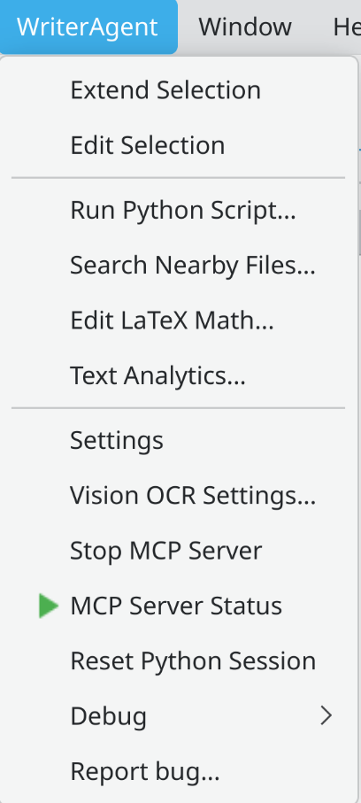
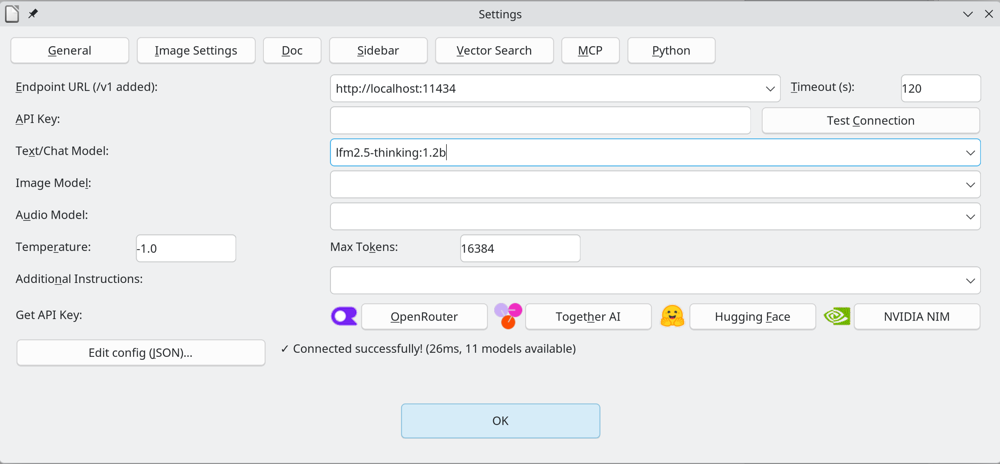
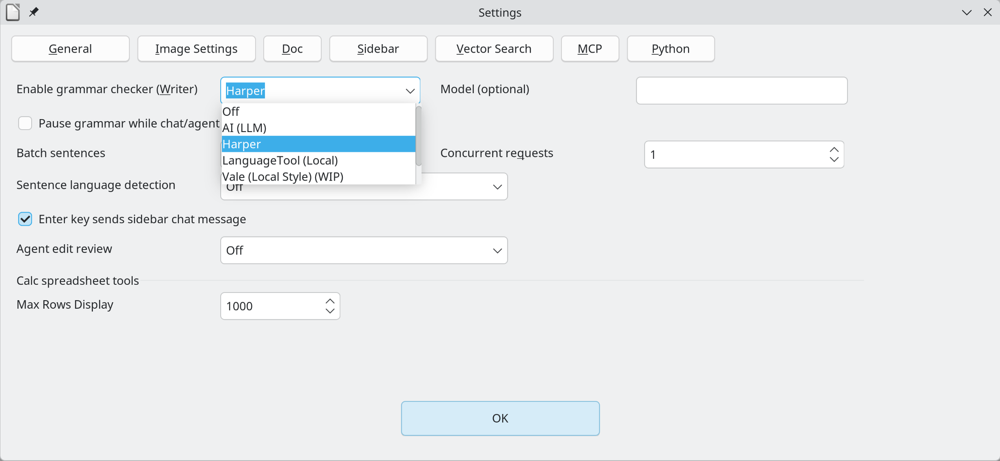

# Install and usage

This page walks through installing WriterAgent, opening Settings and the sidebar, turning on optional grammar checking, and finding the debug log if something goes wrong.

Settings are on the **WriterAgent** menubar of Writer, Calc, Draw / Impress document. The name **WriterAgent** under **Options → Languages** is the grammar proofreader, which is separate and optional.

---

## 1. Download and install

Download from [Release Assets](https://github.com/KeithCu/writeragent/releases/latest). Install **one** of these at a time.

| File | What you get |
|------|----------------|
| **WriterAgent.oxt** | Full product: **WriterAgent** menu, sidebar chat, Settings, Calc `=PROMPT()` / `=PY()`, and grammar (Harper / LanguageTool / LLM). Use this unless you know you want a slimmer package. |
| **LibrePy.oxt** | Python / `=PY()` only. **No** chat menu and **no** WriterAgent Settings. |
| **LibreHarper.oxt** | Grammar checker only. The only UI is in **Languages → Writing Aids**. |

1. Download **WriterAgent.oxt** and double-click it.
2. **Tools → Extension Manager**: **WriterAgent** should be listed and enabled.

3. Open a **Writer document** (**File → New → Text Document**). The **WriterAgent** menu is on that window’s menubar (Calc, Draw, and Impress too).

---

## 2. Settings and sidebar chat

With a document open:

- **Settings:** **WriterAgent → Settings**. Set an OpenAI-compatible **endpoint** and **model**. Local example: `http://localhost:11434` for [Ollama](https://ollama.com/). Cloud (OpenRouter, Together.AI, …): paste an API key in the same dialog.
- **Sidebar:** **View → Sidebar**, then choose the **WriterAgent** deck (sidebar icon).

**No GPU?** Use [OpenRouter free models](https://openrouter.ai/collections/free-models) or [Together.AI](https://www.together.ai/)’s free tier.

---

## 3. Optional: Harper grammar checker

Grammar checking is **optional**. [Harper](https://github.com/Automattic/harper) is the fast local engine and WriterAgent / LibreHarper download it automatically when you select it if not already installed.

### In WriterAgent Settings

**WriterAgent → Settings → Doc** (grammar / proofreader): set **Enable grammar checker (Writer)** to **Harper**. LanguageTool and LLM proofreading are also available; Harper is the local default.

### In LibreOffice Writing Aids

LibreOffice will not draw grammar underlines until the WriterAgent proofreader is enabled for **your document language**.

**Linux:**

1. **Tools → Options → Languages and Locales → Writing Aids**
2. Under available language modules, select **WriterAgent**
3. Open the language list (Edit / the language checkboxes)
4. Enable the language you write in (for example English)

**Windows:** **Tools → Options**, then **Languages and Locales** (or **Language Settings** on some versions) → **Writing Aids**, same WriterAgent + language ticks.

**macOS:** **LibreOffice → Preferences → Languages and Locales → Writing Aids**, then the same steps.

If there are no underlines: the document language (status bar or **Tools → Language**) must match a ticked locale.

---

## 4. Debug log

When something fails, the log is **`writeragent_debug.log`**, in the same folder as **`writeragent.json`**, under the LibreOffice **user profile**.

| OS | Typical locations |
|----|-------------------|
| **Linux** | `~/.config/libreoffice/4/user/config/writeragent_debug.log` or `~/.config/libreoffice/4/user/writeragent_debug.log` (some builds use `24` instead of `4`) |
| **macOS** | `~/Library/Application Support/LibreOffice/4/user/config/writeragent_debug.log` (or `…/4/user/`) |
| **Windows** | `%APPDATA%\LibreOffice\4\user\config\writeragent_debug.log` (or `…\4\user\`) |

If the file does not exist, the extension probably never started (wrong `.oxt`, no restart, or install did not load).

**WriterAgent → Report bug…** opens a GitHub issue form with version, LibreOffice version, OS, endpoint, model, and the log **path**. Paste a **short snippet** of the log if you can. Do not attach API keys, full documents, or the entire log if it contains private text. Details: [bug-reporting.md](bug-reporting.md).

