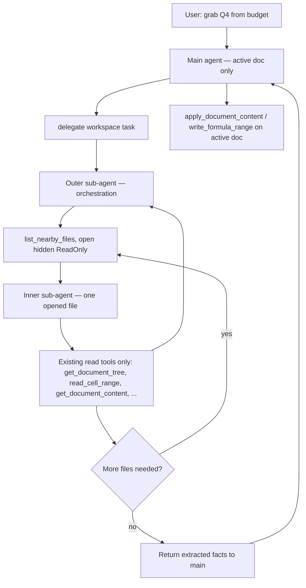

# Multi-Document Support — Development Plan

> **Terminology:** This doc uses **workspace** as a placeholder for “the set of files the agent can see and read.” The final product term is **TBD** (alternatives: project folder, document set, nearby files, etc.). Code and config keys may use `workspace_`* until we settle naming.

> **Living document:** Update this file as phases ship, decisions get made, or scope changes. Link PRs and topic docs from the [Deep dives](#related-docs) section.

---

## Problem

Today WriterAgent is effectively **single-document**: chat resolves one LO model from the sidebar frame, injects `[DOCUMENT CONTENT]` for that doc only, and tools operate on `ToolContext.doc`. Users want cross-document workflows without typing full paths:

- “Grab the Q4 numbers from our budget spreadsheet and add them to this table.” (Writer **or** Calc as the active doc)
- “Pull slide 3 talking points from the deck into this Writer doc.”

Unlike a code repo with thousands of files, a typical office folder has **tens** of documents; **fuzzy names** (“budget 2026”) should resolve without exact filenames. The `@` mention UI is nice-to-have; **backend listing + read** matters more.

---

## MVP

**Phase 0 is intentionally minimal:** Just one API — list files in the same directory as the document you are chatting with.

- `list_nearby_files() -> list[FileEntry]` — files in current doc's parent directory only (LO-relevant extensions, newest first)
- Skip untitled docs with no file path
- No recursion, no subdirectories, no other directories

This alone covers the most common “files next to my report” scenarios with zero complexity. All other features (sub-agents, config directories, UI) come **after** this proves the basic need.

---

## Design principles

| Principle                                | Detail                                                                                                                                                                                                                                                                                                                                                                                                                                                                 |
| ---------------------------------------- | ---------------------------------------------------------------------------------------------------------------------------------------------------------------------------------------------------------------------------------------------------------------------------------------------------------------------------------------------------------------------------------------------------------------------------------------------------------------------- |
| **Same read tools, not main’s schema**   | The **inner** sub-agent calls the same production read tools as today (`get_document_content`, `get_document_tree`, `search_in_document`, `get_sheet_summary`, `read_cell_range`, Draw read tools, …) via `ToolRegistry.execute` — not a parallel extractor. Main chat does **not** register those specialized-tier tools; it only has **core** tools plus `delegate_to_specialized_*_toolset`. Additions for multi-doc: **discovery** (`list_nearby_files` on the outer agent) and **targeting** (open hidden/read-only, point `ToolContext.doc` at that model). |
| **Read-only on other files**             | Mutation tools (`apply_document_content`, `write_formula_range`, `set_style`, shape edits, …) apply to the **active** document only. Nearby / workspace documents are opened **read-only**; write APIs are **not** exposed against those files in MVP (and likely never for the default path — see [Open questions](#open-questions) #4).                                                                                                                              |
| **Writer + Calc + Draw**                 | Calc is first-class (budget → table). Draw/Impress: `list_pages` + shape/text tools where applicable.                                                                                                                                                                                                                                                                                                                                                                  |
| **Active doc unchanged**                 | Cross-doc reads must not steal focus or mutate the user’s window; hidden open in the **same** LO process for MVP.                                                                                                                                                                                                                                                                                                                                                      |
| **Fresh contexts when tool sets change** | **Main chat** keeps one OpenAI-style history; don’t swap its wire tool schema mid-thread. **Sub-agents** are ephemeral task runs (see Two-tier section): they get focused tool context for the job, return a result, and are discarded — not a second chat transcript. We can change APIs in code anytime; new main session or new sub-agent run picks up the new shape.                                                                                                 |
| **Two-tier delegation (preferred)**      | Outer picks the file; **inner** gets read tools for **that** doc type (Calc vs Writer vs Draw). We often don’t know which tool set we need until we know which file we opened. See [Two-tier sub-agent model](#two-tier-sub-agent-model-preferred).                                                                                                                                                                                                                    |
| **Headless later**                       | Target: headless / separate process for large files by default; **defer** until in-process hidden path is solid.                                                                                                                                                                                                                                                                                                                                                       |

---

## Architecture (target state)

**Preferred:** main agent → **outer** workspace sub-agent → **inner** read-only sub-agent(s) → back to main for writes on the active doc only.

**Simpler fallback (Phase 0 only):** main agent calls `list_nearby_files` + a one-shot read facade without nested sub-agents — acceptable for plumbing tests only; long-term we prefer delegation so the main agent’s tool list does not change shape across turns.

**Document resolution today:** sidebar uses `frame.getController().getModel()` (`[SendButtonListener._get_document_model](../plugin/chatbot/panel.py)`); MCP uses `X-Document-URL` + `[resolve_document_by_url](../plugin/doc/document_helpers.py)`. Nearby reads add: filesystem path → file URL → open or match open component.

**Threading:** synchronous UNO on main thread (`[ToolBase.execute_safe](../plugin/framework/tool.py)`); gateway tools that open files should be `is_async=True` if open can block.

---

## Tool API contract (in-process parity, read-only elsewhere)

**Main chat today:** sidebar chat exposes **core**-tier tools for the active doc (read + write on `ToolContext.doc`, frame-bound via the sidebar) plus one **`delegate_to_specialized_{writer|calc|draw}_toolset`** gateway per app. That delegate’s `domain` parameter is an enum of available specialized domains (shapes, python, web_research, …) — not the specialized tools themselves. [`ToolRegistry.get_schemas`](../plugin/framework/tool.py) excludes `specialized` / `specialized_control` from the main wire list; specialized work runs in a sub-agent when `USE_SUB_AGENT` is on ([`DelegateToSpecializedBase`](../plugin/doc/specialized_base.py)).

**Multi-document extension:**

| Scope                                | APIs                                                                                                                                                                                                                                                                                                                                                                       |
| ------------------------------------ | -------------------------------------------------------------------------------------------------------------------------------------------------------------------------------------------------------------------------------------------------------------------------------------------------------------------------------------------------------------------------- |
| **Active document**                  | Unchanged for **main** — same **core** read/write tools on `ToolContext.doc` as today, plus the existing delegate gateway (add `workspace` to its domain enum when shipped).                                                                                                                                                                                                                                                               |
| **Other files (nearby / workspace)** | **Same read tools** as above, invoked against a temporarily opened model (`Hidden` + `ReadOnly`). Plus small **gateway** tools to list files and select which path to open. **No write tools** on those models — no `apply_document_content`, `write_formula_range`, `set_style`, etc. on sibling files unless we explicitly add a later, separate “write nearby” feature. |

**Preferred implementation:** two nested delegations (see next section). Phase 0 may use a one-shot facade temporarily; both paths call `ToolRegistry.execute` — no duplicate tool bodies.

Headless / out-of-process readers (Phase 5), when added, should expose the **same logical read API** to the **inner** sub-agent; only the transport to LO changes.

---

## Two-tier sub-agent model (preferred)

Cross-file reads use **two** ephemeral sub-agent runs (outer, then one or more inners) — same delegation pattern as shapes/python today. Sub-agents are **not** part of the user’s main chat history: each run gets task + tool context, does reactive tool work, and returns a compact result; the smol runtime is torn down afterward. The main agent keeps **the same wire tool list it has today** — **no new tools on main** beyond adding `workspace` to the existing `delegate_to_specialized_*_toolset` domain enum. Rationale: [Why two tiers](#why-two-tiers).

### Roles

| Layer                                                   | Responsibility                                                                                                                                                       | Tool surface                                                                                                                                                                                                                                              |
| ------------------------------------------------------- | -------------------------------------------------------------------------------------------------------------------------------------------------------------------- | --------------------------------------------------------------------------------------------------------------------------------------------------------------------------------------------------------------------------------------------------------- |
| **Main agent**                                          | User intent; edits **active** doc only (`apply_document_content`, `write_formula_range`, `set_style`, …).                                                            | **Core** tools on active `ToolContext.doc` + `delegate_to_specialized_{writer|calc|draw}_toolset` (domain enum includes shapes, python, …; add **`workspace`** for multi-doc). No specialized-tier tools on main’s wire schema.                                                                                          |
| **Outer sub-agent** ("workspace" / nearby orchestrator) | Receives a natural-language **task** from main. **Lists** nearby files, **resolves** fuzzy names, calls **inner** once per file that must be read, aggregates answers. | `list_nearby_files` (and later config-expanded list), `delegate_read_document(path, task)` per file (opens hidden/read-only, runs inner, collects result). `final_answer` / tool return to main. **No** `apply_*` / `write_*` on any model.                                                                              |
| **Inner sub-agent** (“document reader”)                 | One **ephemeral** run per opened file; `doc_type` known (`writer` / `calc` / `draw`). Reads that model only; returns extracted data to **outer**.                   | **Read tools for that type only** — Writer inner never sees `read_cell_range`; Calc inner never sees `get_document_tree`. Same production schemas as today; **no writes.** Each file = **new** inner run (fresh tool allowlist + task context; discarded after return).                                                    |

### Reference scenario (how it might run)

This is the **intended** handling for a typical request — exact tool names TBD, but the **roles** should work like this:

**User (on active report or sheet):** “Get Q4 numbers and put them in a table.”

| Step | Who                 | What happens                                                                                                                                                                                                                                                                                                          |
| ---- | ------------------- | --------------------------------------------------------------------------------------------------------------------------------------------------------------------------------------------------------------------------------------------------------------------------------------------------------------------- |
| 1    | **Main agent**      | Parses intent: (a) **read** Q4 figures from somewhere — user said “budget” or context implies a budget file; (b) **write** a table on the **active** doc. Does **not** open sibling files itself.                                                                                                                     |
| 2    | **Main agent**      | One delegate call, task string carries what main already knows, e.g. `delegate_*(domain="workspace", task="Find Q4 numbers in the budget spreadsheet and return them as structured data")`. Main may say “budget” even if the user only said “Q4 numbers” — from chat context, `[DOCUMENT CONTENT]`, or a prior turn. |
| 3    | **Outer sub-agent** | `list_nearby_files` (optional filter `"budget"`) → fuzzy match candidates (e.g. `Budget_2026.ods`, `Budget_2025.ods`; newest-first bias).                                                                                                                                                                              |
| 4    | **Outer sub-agent** | For the file(s) to read: `delegate_read_document(path, task)` — open **hidden, read-only**, spawn **inner** with a focused task (e.g. “extract Q4 revenue from this spreadsheet”). One inner run per file; outer keeps orchestration, not the read tool schema.                                                         |
| 5    | **Inner sub-agent** | On that opened Calc model only: `get_sheet_summary` → `read_cell_range` (Writer budgets: `search_in_document` / `get_document_content`). Returns extracted numbers to **outer**; inner context is discarded.                                                                                                          |
| 6    | **Outer sub-agent** | Need another year or file? Repeat step 4 (e.g. inner on `Budget_2025.ods` with its own task). Aggregate all inner results, then **final_answer** to main: e.g. “2024 Q4: …; 2025 Q4: …” (structured JSON OK).                                                                                                        |
| 7    | **Main agent**      | Receives tool result only — no nearby-file read tools on main. Uses normal **active-doc write** tools: `write_formula_range`, `apply_document_content`, `insert_cell_html`, etc., to build the table on the doc the user is looking at.                                                                               |

**Important:** Main never needs the budget file’s full tool schema. It issues **one** workspace delegation with a focused read task, then does **insert/edit on the active document** with the returned payload.

If the user never mentioned “budget,” outer still discovers it by listing + matching (“Q4”, “revenue”, newest `.ods`) — main’s delegate task can be vaguer (“find Q4 numbers in nearby spreadsheets”).

### Shorter control-flow checklist

1. User: “Get Q4 numbers and put in a table.”
2. **Main** → delegate workspace: “find Q4 numbers in [the] budget …”
3. **Outer** → list → for each needed file: `delegate_read_document(path, task)` → **inner** reads that file → **outer** aggregates → returns figures to main.
4. **Main** → `write_*` / `apply_*` on **active** doc only.

If the first file was wrong, **outer** repeats list/open/inner before step 4.

### Why two tiers

**1. Within-session tool stability on main**  
Imagine one long main thread where prior `tool_calls` referenced tools that are no longer on the wire schema. **Restart main chat = fine.** **Mid-session schema churn on main = avoid** until we’ve run lots of tests. Sub-agents avoid that: each outer/inner run is a **separate** smol task with its own tool allowlist and context; results fold back into main as a single tool result — no extra turns in the user’s transcript.

**2. Right tools only after we know the file**  
Outer lists and opens; **then** we know whether inner needs Calc or Writer (or Draw) tools — e.g. budget `.ods` → `read_cell_range`; policy `.odt` → `get_document_tree` / `search_in_document`. We can’t pick the right inner allowlist until we’ve chosen a file. A single “read nearby” agent with every modality’s tools in one schema would be noisy; bolting that onto **main** would be worse. Inner = fresh context + **allowlist for `doc_type`**.

**3. Outer vs inner split**  

- **Outer:** file discovery, open read-only, “need another file?”, aggregate for main (file-type agnostic).  
- **Inner:** one file, one modality, production read APIs only.

Yes, two sub-agents is extra machinery — but it matches “we don’t know Writer vs Calc until we open the budget / brief.”

**4. Multi-file orchestration**  
Outer lists once, then delegates to **inner** separately per file — e.g. “grab 2024 and 2025 numbers” → `delegate_read_document("Budget_2024.ods", "extract Q4 revenue")`, then `delegate_read_document("Budget_2025.ods", "extract Q4 revenue")` — each inner returns to outer; outer aggregates once for main.

**5. Main stays lean; conservative default**  
Users who never use workspace features pay **zero** extra tool-schema cost; sub-agents load on demand. That matters for small local models and until multi-document flows are heavily dogfooded.

**6. Anti-pattern: read tools on main**  
Adding `list_nearby_files` and every read tool directly to main would work but **pollutes the schema for everyone**. Delegation scales better: discovery vs reading stay separated, and we reuse all existing read tools without duplicate extractors.

**Implementation note:** Delegation infrastructure already exists — same pattern as Python’s `run_venv_python_script` (see open question #2). Exposing tools on main vs specialized is mostly base-class / registry wiring (`SpecializedDomainBase`, `ToolRegistry.filter()`, `run_sub_agent()`), not greenfield. Matches `[DelegateToSpecializedBase](../plugin/doc/specialized_base.py)` / web_research; keeps main to one delegate + compact result (`[smol-main-chat-tool-architecture.md](smol-main-chat-tool-architecture.md)`).

**Not the reason:** freezing APIs for engineering convenience (we change them when we want; sub-agents restart clean).

### Handoff mechanism (implementation sketch)

- Outer tool `delegate_read_document(path_or_name, task)` (name TBD): open hidden if needed, build `ToolContext(doc=opened_model, …)`, run **inner** `ToolCallingAgent` / smol agent with `registry.get_tools(..., active_domain="nearby_read")` or explicit allowlist of read tool names.
- Inner ends with `specialized_workflow_finished` / `final_answer` carrying extracted content.
- Outer accumulates per-file results; final tool return is a single payload to main.

---

## Reusing existing read tools (not new extractors)

The **inner** sub-agent calls production read tools via `ToolRegistry.execute` — no duplicate implementations:

1. **Outer** resolves path / fuzzy name from catalog.
2. **Outer** obtains UNO `model` (already open via `resolve_document_by_url`, else `loadComponentFromURL` with `Hidden` + `ReadOnly` — [pattern in `plugin/writer/format.py](../plugin/writer/format.py)`).
3. **Inner** receives `ToolContext(doc=model, doc_type=…, ctx=…)`.
4. **Inner** invokes read tools only, e.g.:

| Source doc type    | Typical tools for inner agent (fixed allowlist per doc type)                                                                                                                              |
| ------------------ | ----------------------------------------------------------------------------------------------------------------------------------------------------------------------------------------- |
| **Writer**         | `get_document_content` (`[plugin/writer/content.py](../plugin/writer/content.py)`), `get_document_tree` (`[plugin/writer/outline.py](../plugin/writer/outline.py)`), `search_in_document` |
| **Calc**           | `get_sheet_summary` (`[plugin/calc/sheets.py](../plugin/calc/sheets.py)`), `read_cell_range` (`[plugin/calc/cells.py](../plugin/calc/cells.py)`)                                          |
| **Draw / Impress** | `list_pages`, draw summary / shape tools as needed                                                                                                                                        |

**Calc example (two-tier):** User has `Q4_Report.odt` open, says “put Q4 revenue from the budget into the table.” **Main** delegates workspace task → **outer** lists, opens `Budget_2026.ods` → **inner** runs `get_sheet_summary` + `read_cell_range` → **outer** returns “Q4 revenue: …” → **main** uses `apply_document_content` or `write_formula_range` on the active doc only.

---

## Open questions

Record decisions here as we learn.

| #   | Question                                         | Notes                                                                                                                                                                                                                                                                                                                                                            |
| --- | ------------------------------------------------ | ---------------------------------------------------------------------------------------------------------------------------------------------------------------------------------------------------------------------------------------------------------------------------------------------------------------------------------------------------------------- |
| 1   | **Catalog in main system prompt?**               | Option A: inject `[NEARBY FILES]` (or similar) every turn — helps “budget” disambiguation, costs tokens. Option B: main agent only knows tools exist; calls `list_`* when needed — leaner context. Option C: hybrid — inject only when directory has ≤N files or user message mentions another doc. **Default lean toward B for MVP; revisit after dogfooding.** |
| 2   | **Main agent vs sub-agent for multi-file tasks** | **Decision: two-tier delegation** — main only calls `delegate_to_specialized_*_toolset(domain="workspace", …)`; **outer** lists and orchestrates; **inner** runs read tools per opened file (one ephemeral run per file). Same pattern as Python (`run_venv_python_script` domain): main stays on core + delegate.                             |
| 3   | **Untitled / unsaved active doc**                | No parent directory → list only other open LO documents, or disable nearby tools with clear error.                                                                                                                                                                                                                                                               |
| 4   | **Write-back to nearby files**                   | **Out of scope for default design:** other files are read-only; writes stay on the active doc. If ever needed, would be a deliberate separate feature (non-read-only open + same write tools as in-process agent), not part of MVP.                                                                                                                              |
| 5   | **Final naming**                                 | `workspace_`* vs `nearby_`* vs `project_*` — align UI, config, and prompts when term is chosen.                                                                                                                                                                                                                                                                  |

---

## Phased implementation

Phases are incremental; each should be shippable with tests (`make test`). Adjust phase numbers if we merge or split work.

### Phase 0 — Same-directory MVP

**Goal:** List files in the same directory as the current document.

**Scope:**

- New module `[plugin/doc/nearby.py](../plugin/doc/nearby.py)`:
  - `get_document_directory(model) -> str | None` from `[get_document_path](../plugin/doc/document_helpers.py)`.
  - `list_nearby_files() -> list[FileEntry]` — scandir current doc's directory only, LO-relevant extensions, **newest first**.
- Expose on main agent (or via `delegate_to_specialized_*_toolset`) — single API, no sub-agents yet
- **Tests:** `plugin/tests/doc/test_nearby.py` (pure Python)

**Out of scope for Phase 0:** config directories, sub-agents, recursion, system prompt injection, `@` UI, headless process, reading file contents.

**Prompt:** Short tool description only ("lists other files in the same folder as this document").

---

- Settings UI: simple text field for JSON array later; not required for first merge.

---

### Phase 2 — Prompt integration (optional / gated)

**Goal:** If we want the model to see filenames without calling `list_`* first.

- Compact `[NEARBY FILES]` block in `[ChatSession.set_system_context](../plugin/chatbot/panel.py)` or via `[get_document_context_for_chat](../plugin/doc/document_helpers.py)` — cap count/chars (e.g. 50 files / 2000 chars).
- Guidance blurb in `[plugin/framework/constants.py](../plugin/framework/constants.py)` templates (Writer / Calc / Draw), gated by config flag default **off**.
- Re-evaluate open question #1 after measuring token use.

---

### Phase 3 — Two-tier sub-agents (`workspace` domain)

**Goal:** Cross-file reads via sub-agents; **main agent’s tool schema unchanged** across turns (see [Why two tiers](#why-two-tiers)).

- **Main → outer:** `delegate_to_specialized_*_toolset(domain="workspace", task="...")` — follow `[DelegateToSpecializedBase](../plugin/doc/specialized_base.py)` + `[USE_SUB_AGENT](../plugin/framework/constants.py)`.
- **Outer agent tools:** `list_nearby_files`, open/read-only helpers, `delegate_read_document(task)` (spawns inner), workflow finished / `final_answer` to main. **No write tools.**
- **Inner agent tools:** allowlisted **existing read tools** for the opened doc’s `doc_type` only (`get_document_tree`, `read_cell_range`, `get_document_content`, `search_in_document`, `get_sheet_summary`, Draw read tools, …). Same schemas as in-process agent; **no writes.**
- **Outer loop:** after each inner result, decide whether another file must be opened; aggregate; return one payload to main (e.g. “here are the Q4 numbers you asked for”).
- **Main** applies results to **active** doc only (`apply_document_content`, `write_formula_range`, etc.).
- Tests: mock inner agent; one UNO integration test outer → inner → read Calc range.

---

### Phase 4 — Hidden open hardening

**Goal:** Reliable in-process opens without disturbing the user.

- Weakref cache of hidden models per path; close after read or idle timeout.
- Size heuristic: small files in-process; document threshold for “large” (no headless yet — log/warn only).
- UNO tests for Writer, Calc, Draw/Impress samples.

---

### Phase 5 — Headless / separate process (deferred)

**Goal:** Large files do not block the UI LO instance.

- Persistent or one-shot `soffice --headless` with separate user profile (`--env:UserInstallation=...`).
- Worker script or UNO bridge; `[AsyncProcess](../plugin/framework/worker_pool.py)` for lifecycle.
- **Default to headless for non-small docs** once stable; until then Phase 4 in-process only.
- Fallback to in-process hidden open on failure.

---

### Phase 6 — UI: `@` mentions and pickers (deferred)

**Goal:** Discoverability, not required for core behavior.

- `[QueryKeyListener](../plugin/chatbot/panel.py)` / listeners: `@` triggers filtered list from catalog (`[ChatPanelDialog.xdl](../extension/WriterAgentDialogs/ChatPanelDialog.xdl)` — popup may be awkward; button + `FilePicker` is acceptable MVP UI).
- Insert token or pass selected path into send pipeline.
- See [chat-sidebar-implementation.md](chat-sidebar-implementation.md) for sidebar constraints.

---

### Phase 7 — Polish

- Metadata cache (title, headings, sheet names) keyed by path + mtime — SQLite optional.
- MCP: same tools; optional `X-Document-URL` unchanged for **active** doc, nearby reads via tool args only.
- Recent LO documents list (`[RecentDocumentList](https://api.libreoffice.org/)` — if worth the coupling).
- Drag-and-drop onto chat.

---

## Calc-specific scenarios (acceptance checks)

Use these to validate design and tests:

1. **Active Calc, read sibling Calc:** main delegates → outer lists/opens budget → inner `read_cell_range` → outer returns figures → main `write_formula_range` on active sheet.
2. **Active Calc, read sibling Writer:** inner `get_document_content` on brief → main `insert_cell_html` / `write_formula_range`.
3. **Active Writer, read sibling Calc:** inner `get_sheet_summary` + `read_cell_range` → main `apply_document_content`.
4. **Multiple budgets:** **outer** `list_nearby_files(filter="budget")`, pick or disambiguate, optionally run inner twice before returning to main.
5. **Formula semantics:** **main** respects Calc `;` separator rules (`[CALC_FORMULA_SYNTAX](../plugin/framework/constants.py)`) when writing to active sheet only.

---

## Writer / Draw scenarios (acceptance checks)

1. **Outline-first:** `get_document_tree` on nearby `.odt` before full read for long docs.
2. **Search:** `search_in_document` on nearby file for “Q4” instead of full HTML dump.
3. **Draw/Impress:** Nearby `.odp` → `list_pages` + text extraction; insert into active Writer/Calc via existing apply/write tools.

---

## Files and entry points (planned)

| Area                   | Path                                                                                                                                  |
| ---------------------- | ------------------------------------------------------------------------------------------------------------------------------------- |
| Catalog + hidden open  | `plugin/doc/nearby.py` (or `workspace.py` — rename when term fixed)                                                                   |
| Tools                  | `plugin/doc/nearby_tools.py` — registered from doc module init                                                                        |
| Config                 | `plugin/doc/module.yaml`                                                                                                              |
| Document path / URL    | `[plugin/doc/document_helpers.py](../plugin/doc/document_helpers.py)`                                                                 |
| Chat context / prompts | `[plugin/chatbot/panel.py](../plugin/chatbot/panel.py)`, `[plugin/framework/constants.py](../plugin/framework/constants.py)`          |
| Tool loop              | `[plugin/chatbot/tool_loop.py](../plugin/chatbot/tool_loop.py)`                                                                       |
| Delegation             | `[plugin/doc/specialized_base.py](../plugin/doc/specialized_base.py)`, `plugin/doc/nearby_specialized.py` (outer + inner agents, TBD) |
| MCP                    | `[plugin/mcp/mcp_protocol.py](../plugin/mcp/mcp_protocol.py)` — no change required for MVP                                            |

---

## Test strategy

| Phase | Tests                                                              |
| ----- | ------------------------------------------------------------------ |
| 0     | `test_nearby.py`: listing, sort, fuzzy resolve, extension filter   |
| 0     | `test_nearby_uno.py`: hidden open Writer + Calc, read via registry |
| 1     | Config merge paths, dedupe                                         |
| 2     | Prompt snapshot / max length                                       |
| 3     | Mock sub-agent delegation; one integration test cross-doc          |
| 4–5   | UNO + optional subprocess mocks                                    |
| 6     | Manual UI checklist                                                |

Per [AGENTS.md](../AGENTS.md): new logic in matching `test_*.py`; run `make test` before calling a phase done.

---

## Related docs

- [chat-sidebar-implementation.md](chat-sidebar-implementation.md) — frame-bound doc, send pipeline
- [smol-main-chat-tool-architecture.md](smol-main-chat-tool-architecture.md) — sub-agents, tool loop
- [calc-specialized-toolsets.md](calc-specialized-toolsets.md) — Calc tool surface
- [mcp-protocol.md](mcp-protocol.md) — `X-Document-URL`, main-thread execute
- [agent-search.md](agent-search.md) — external fetch pattern (contrast with nearby files)

---

