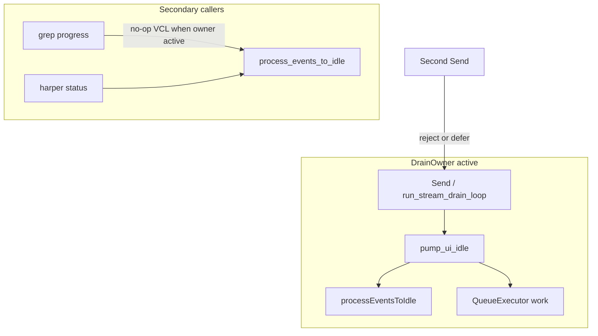
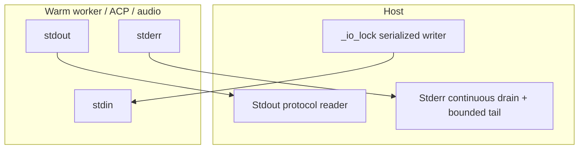

# Systemic Reliability Plan: UI Reentrancy, Static Enforcement & Subprocess IPC

> **Consolidates:** UI event-loop sentry, Opengrep reliability rules, controlled drain ownership, and subprocess IPC safety
> **Status:** Implemented — drain ownership, static rules, live stderr drains, bounded venv stdin writes, and regression coverage — 2026-08-05
> **Related:** [streaming-and-threading.md](streaming-and-threading.md), [uno-thread-safety-enforcement.md](uno-thread-safety-enforcement.md), [threading_architecture.md](threading_architecture.md)

---

## 1. Executive Summary

WriterAgent enforces **off-main-thread UNO access** (Layer A–C in [uno-thread-safety-enforcement.md](uno-thread-safety-enforcement.md)), main-thread drain ownership at runtime, and related Opengrep rules. This document is the single source of truth for three related reliability concerns:

1. **Main-thread nested reentry:** Harmful nesting of drain loops / non-reentrant mutations when VCL re-enters Python listeners. This is **not** the same as forbidding all VCL pumping from listener stacks — chat Send intentionally runs a synchronous drain that must keep pumping so the UI repaints and Stop stays actionable.
2. **Static enforcement:** Raw background threads, raw VCL pumps, unsafe piped stderr, and selected unguarded disposed-document access are checked in [`uno_thread_safety.yml`](../tests/semgrep/uno_thread_safety.yml).
3. **Subprocess pipe deadlocks:** Long-lived children with `stderr=PIPE` can fill the kernel pipe buffer while the parent blocks on stdin/stdout. Continuous stderr drains and bounded venv stdin writes prevent both sides of this deadlock.

This plan extends existing chokepoints — [`pump_ui_idle`](../plugin/framework/queue_executor.py), [`process_events_to_idle`](../plugin/framework/uno_context.py), [`AsyncProcess`](../plugin/framework/worker_pool.py), [`PythonWorkerManager`](../plugin/scripting/venv_worker.py) — rather than introducing a parallel `SafeSubprocessIPC` / `process_manager.py` layer.

---

## 2. What Already Exists (Do Not Reinvent)

| Capability | Location | Status |
|---|---|---|
| Off-main-thread UNO guard | [`thread_guard.py`](../plugin/framework/thread_guard.py), Opengrep Layer C | **Done** |
| UI drain sentry | [`async_drain_guard.py`](../plugin/framework/async_drain_guard.py) | **Done** |
| Chat drain owns VCL pumping | [`async_stream.py`](../plugin/framework/async_stream.py) → `pump_ui_idle` | **Done** (see [streaming-and-threading.md](streaming-and-threading.md) §7) |
| Drain ownership + nested reject | [`queue_executor.py`](../plugin/framework/queue_executor.py) `drain_owner_scope` | **Done** |
| Secondary VCL pump chokepoint | [`uno_context.py`](../plugin/framework/uno_context.py) `process_events_to_idle` | **Done** (no-op under owner) |
| Marshal + idle co-drain | [`queue_executor.py`](../plugin/framework/queue_executor.py) `pump_ui_idle` | **Done** |
| Shared stderr drain helper | [`worker_pool.py`](../plugin/framework/worker_pool.py) `start_stderr_drain` | **Done** |
| Stdout/stderr drain helpers | [`worker_pool.py`](../plugin/framework/worker_pool.py) `AsyncProcess` | **Done** |
| Venv / ACP / audio live stderr drain | `venv_worker`, `acp_connection`, `audio_recorder_service` | **Done** |
| Linux pipe size expand | [`sandbox.py`](../plugin/scripting/sandbox.py) `optimize_popen_pipes` (used by venv spawn) | **Done** |
| Harper stderr avoidance | [`harper.py`](../plugin/writer/locale/harper.py) `stderr=DEVNULL` + stdout reader | **Done** — left alone |
| Monaco stderr drain + bounded tail | [`editor_host.py`](../plugin/scripting/editor_host.py) `_stderr_drain_loop` | **Done** |
| Opengrep thread / pump / pipe / disposed rules | [`uno_thread_safety.yml`](../tests/semgrep/uno_thread_safety.yml) | **Done** |

---

## 3. UI Event-Loop Sentry & Controlled Drain Ownership

### 3.1 Problem Analysis

LibreOffice’s VCL loop is single-threaded. Nested `processEventsToIdle()` can re-enter PyUNO listeners and deadlock. But a **blanket** rule “never pump inside a listener” conflicts with production chat:

```
[Main Thread] VCL
  └── SendButtonListener.on_action_performed  (panel.py)
       └── StartSendEffect → _do_send()       (synchronous, intentional)
            └── run_stream_drain_loop
                 └── pump_ui_idle → processEventsToIdle   ← REQUIRED for repaint + Stop
```

If pumps become no-ops whenever “listener depth > 0”, Send freezes and cancellation dies. Harmful cases are **nested drain owners** and **unguarded pumps from secondary loops / marshaled work**, not the existence of a single controlled drain.

#### Failure classes to prevent

1. Nested `run_stream_drain_loop` / second Send while one drain owns the main thread.
2. Marshaled work calling raw `processEventsToIdle()` while the drain loop already owns pumping (double pump / unexpected reentry).
3. Non-reentrant mutations (modify listeners, spill listeners) that run heavy sync UNO and can reenter themselves via pumps.

#### Risk sites (inventory — treat per site, not one policy)

| Site | Role | Treatment |
|---|---|---|
| [`async_stream.py`](../plugin/framework/async_stream.py) / [`tool_loop.py`](../plugin/chatbot/tool_loop.py) | **Legitimate drain owner** | Keep pumping via `pump_ui_idle`; enforce single owner |
| [`panel.py`](../plugin/chatbot/panel.py) `StartSendEffect` | Starts drain from action listener | Reject/defer nested sends; do **not** no-op owner pumps |
| [`document_research_grep.py`](../plugin/doc/document_research_grep.py) | Batch progress pumps | Route through chokepoint; no-op or reduce when drain already owns |
| [`editor_host.py`](../plugin/scripting/editor_host.py) `wait_for_ready` | Startup wait loop | Use the guarded chokepoint; do not take a nested owner (`ready` is set by its reader thread) |
| [`dialogs.py`](../plugin/chatbot/dialogs.py) / [`dialog_views.py`](../plugin/chatbot/dialog_views.py) | Modal / eval suite pumps | Route through chokepoint; evaluate whether pump is needed |
| [`harper.py`](../plugin/writer/locale/harper.py) `_pump_grammar_status_ui` | Status UI pump via `post_to_main_thread` | Keep deferral; still use chokepoint (note: `post` can inline — see §3.3) |
| [`writer_importer.py`](../plugin/notebook/writer_importer.py) | Cell render flush | Route through chokepoint |
| [`calc/charts.py`](../plugin/calc/charts.py) | Headless-guarded pump | Keep headless short-circuit; use chokepoint |
| [`inline_review.py`](../plugin/writer/inline_review.py) | **Intentionally avoids** pump | Document as hang class: idle may never arrive |
| Modify / spill listeners (`review_toolbar`, `calc/python/function`) | Sync heavy UNO, usually no pump | Prefer defer non-trivial work; not a pump-depth problem |

There is **no** `XSelectionChangeListener` usage in `plugin/` today — do not center tests or Opengrep rules on that type.

### 3.2 Architectural Invariants

1. **One active drain owner per UI/session.** Nested sends or nested drain loops are rejected or deferred; they must not start a second `run_stream_drain_loop`.
2. **Approved pump entry points only:** [`pump_ui_idle`](../plugin/framework/queue_executor.py) and [`process_events_to_idle`](../plugin/framework/uno_context.py). Raw `toolkit.processEventsToIdle()` outside those helpers is a lint error.
3. **Owner may pump; non-owners must not.** When a drain owner is active, secondary callers of `process_events_to_idle` become no-ops (or queue-only) so they do not nest VCL pumps. The owner’s `pump_ui_idle` continues to drain the work queue **then** pump VCL (existing order).
4. **Do not assume `post_to_main_thread` defers.** [`QueueExecutor.post`](../plugin/framework/queue_executor.py) can run inline under `WRITERAGENT_TESTING=1` or when AsyncCallback is unavailable. Strict deferral needs an explicit enqueue-only API with defined unavailable-service behavior.
5. **Off-main-thread UNO remains Layer A–C’s job** — this feature does not replace [`thread_guard.py`](../plugin/framework/thread_guard.py).



### 3.3 Implementation Record

#### Step 1: Drain ownership + pump funnel — done

Drain ownership is implemented in [`async_drain_guard.py`](../plugin/framework/async_drain_guard.py) and exposed through [`queue_executor.py`](../plugin/framework/queue_executor.py). Secondary-pump suppression is implemented in [`uno_context.py`](../plugin/framework/uno_context.py):

```python
# Conceptual API — names can match existing style

@contextmanager
def drain_owner_scope(name: str):
    """Mark this stack as the sole VCL pump owner (e.g. chat drain loop)."""
    ...

def process_events_to_idle(ctx, rounds: int = 1) -> bool:
    """Pump VCL only when allowed for this caller (owner or no active owner)."""
    ...

def pump_ui_idle(toolkit, *, max_queue_items: int = 1, executor=None) -> None:
    """Always drain QueueExecutor; pump VCL only when this call is from the owner
    (or when no owner is active for non-chat wait loops that take ownership)."""
    pump_main_thread_work_queue(max_items=max_queue_items, executor=executor)
    ...
```

Debug-only counters/logs when a secondary pump is suppressed (detect silent UI staleness).

#### Step 2: Nested Send / nested drain rejection — done

[`run_stream_drain_loop`](../plugin/framework/async_stream.py) takes ownership automatically. Busy-state gating prevents ordinary second sends, and `NestedDrainOwnerError` rejects any second drain that still reaches the boundary.

#### Step 3: Migrate raw pumps to chokepoints — done

Route inventory sites through `process_events_to_idle` / `pump_ui_idle`. Per-site policy:

- Progress helpers under an active chat drain → no-op VCL (queue drain may still run if useful).
- Standalone wait loops (editor ready) → use the guarded chokepoint without claiming a nested owner.
- Do **not** wrap every listener with a depth no-op that disables the Send drain.

#### Step 4: Listener heavy work — deferred, evidence-driven

Do not add a generic listener-deferral abstraction without a concrete reentrancy failure. Prefer existing `post_to_main_thread` / `execute_on_main_thread` patterns at an affected call site.

---

## 4. Feature #4: Subprocess IPC Pipe Safety (Extend Existing Code)

### 4.1 Problem Analysis

Classic deadlock: parent blocked on stdin write / stdout read while child’s `stderr` fills (~64 KiB default on Linux). Note: `/proc/sys/fs/pipe-max-size` is the **max allowed** pipe size, not the default capacity of every pipe. Linux expansion via `optimize_popen_pipes` already raises capacity where supported — it reduces but does **not** remove the need for live drains.

#### Current status

| Component | Stdout | Stderr | Priority |
|---|---|---|---|
| [`AsyncProcess`](../plugin/framework/worker_pool.py) | Live drain | Live drain | Keep as shared helper |
| [`PythonWorkerManager`](../plugin/scripting/venv_worker.py) | Timed/select reads + bounded writes | Live bounded drain | Done |
| [`ACPConnection`](../plugin/agent_backend/acp_connection.py) | Reader thread | Live bounded drain | Bounded writes deferred; JSON messages are small |
| [`audio_recorder_service.py`](../plugin/scripting/audio_recorder_service.py) | Monitor thread | Live bounded drain | Done |
| [`harper.py`](../plugin/writer/locale/harper.py) | Reader thread | `DEVNULL` | Done — leave alone |
| [`editor_host.py`](../plugin/scripting/editor_host.py) | Reader | Continuous + bounded tail | Done |

### 4.2 Architectural Invariants

1. Every long-lived `stderr=PIPE` child has a **continuous** drain (daemon thread) **or** redirects stderr (`DEVNULL` / file).
2. Prefer a **bounded diagnostic tail** (as in Monaco editor) over unbounded `queue.Queue` growth.
3. Preserve existing protocol framing ([`ipc.py`](../plugin/scripting/ipc.py), pickle frames, heartbeats, PPT-Master mid-response stdin). Do not replace framed readers with a generic “read_line from chunk queue.”
4. Venv stdin writes are bounded; if an initial request write times out, terminate and retry once on a fresh worker. Host **read** timeouts (hung user code / C extensions) terminate without replay so Calc does not wait twice. If a PPT-Master intermediate write times out, terminate without replaying the turn because host-side UNO mutations may already have occurred.
5. One serialized writer per child (venv already uses `_io_lock`).



### 4.3 Implementation Status

#### Shared stderr drain — done

[`start_stderr_drain`](../plugin/framework/worker_pool.py) continuously consumes a pipe and retains a bounded diagnostic tail. Venv, ACP, and audio start it immediately after `Popen`; Harper redirects stderr to `DEVNULL`.

#### Bounded `PythonWorkerManager` stdin writes — done

The timeout is local to [`venv_worker.py`](../plugin/scripting/venv_worker.py):

- Serialize with `pack_pickle_frame` before starting the timed write.
- Write and flush in a daemon writer thread on POSIX and Windows.
- On timeout, log, terminate the process group (POSIX `killpg`; Windows `taskkill /T`), join the writer, and raise a sanitized timeout error.
- Keep `_io_lock` held through cleanup.
- Permit the existing one-time retry only for the initial request frame and for crash/EOF (`BrokenPipeError` / empty stdout / `OSError`). Do not replay after a host **read** timeout.
- Treat PPT-Master intermediate writes as non-replayable and return an error after termination.

Do not rewrite pickle framing, heartbeat readers, ACP, or Monaco as part of this step.

#### Policy — done

[`AGENTS.md`](../AGENTS.md) mandates that piped stderr be drained continuously or redirected and points at `AsyncProcess`.

---

## 5. Opengrep Static Enforcement

All reliability rules live in [`tests/semgrep/uno_thread_safety.yml`](../tests/semgrep/uno_thread_safety.yml); do not create a parallel reentrancy rules file.

Implemented rules include:

1. **`raw-uno-thread-ban` (ERROR):** rejects direct `threading.Thread` / `threading.Timer` construction outside the centralized worker implementation. Production code uses [`run_in_background`](../plugin/framework/worker_pool.py).
2. **`raw-process-events-to-idle` (ERROR):** rejects direct VCL pumps outside the approved queue/UNO chokepoints.
3. **`piped-stderr-needs-drain` (WARNING):** flags long-lived `stderr=PIPE` subprocesses that are not migrated or explicitly allowlisted.
4. **`uno-disposed-check-required` (WARNING):** flags selected document-model access without a recognized disposal-check boundary. This is intentionally narrow to limit false positives.
5. **`uno-off-main-thread` and decorator rules:** enforce Layer C thread-boundary conventions described in [uno-thread-safety-enforcement.md](uno-thread-safety-enforcement.md).

Run `make opengrep-lint` for blocking project rules. Promote advisory warnings only after their signal is validated against the full tree.

---

## 6. Verification & Testing

### 6.1 Static acceptance

- `make opengrep-lint` passes the project rules and their positive/negative fixtures.
- Raw `processEventsToIdle()` remains confined to the approved implementation chokepoint.
- New long-lived `stderr=PIPE` sites either start a continuous drain or redirect stderr.
- Reentrancy rules remain behavior-based; do not key them on `XSelectionChangeListener` alone.

### 6.2 Automated tests (observable acceptance criteria)

Replace unverifiable claims (“no C++ VCL recursion”) with:

| Test | Home | Asserts |
|---|---|---|
| Drain ownership | Extend [`tests/framework/test_async_stream.py`](../tests/framework/test_async_stream.py) | Nested owner rejected; owner pumps call toolkit; secondary `process_events_to_idle` no-ops while owner active; ownership cleared after exception |
| Pump chokepoint | Extend [`tests/framework/test_uno_context.py`](../tests/framework/test_uno_context.py) | Suppression counters / mock toolkit call counts |
| Stop still works under owner | Chat/async_stream tests | Stop checker observed while drain pumps |
| Venv stderr flood | Extend [`tests/scripting/test_venv_worker.py`](../tests/scripting/test_venv_worker.py) | Real `PythonWorkerManager` spawn drains > pipe capacity before the child reads stdin; response and teardown complete |
| Venv blocked stdin | Extend [`tests/scripting/test_venv_worker.py`](../tests/scripting/test_venv_worker.py) | Child that never reads a large frame times out; worker and writer thread exit; lock remains usable |
| PPT-Master timeout | Extend [`tests/scripting/test_venv_worker.py`](../tests/scripting/test_venv_worker.py) | Intermediate write timeout terminates the worker without replaying the turn |
| AsyncProcess / shared drain | [`tests/framework/test_worker_pool.py`](../tests/framework/test_worker_pool.py) | Existing flood test proves the shared drain consumes > pipe capacity |

Use Layer B patterns (`uno_thread_safety`, `set_force_marshal_mode`) where marshal boundaries matter. Native UNO tests are integration smoke only (rapid Send + Stop); they are not the primary proof of depth/ownership.

Existing headless hang-related skips ([`test_document_research_grep_uno.py`](../tests/doc/test_document_research_grep_uno.py), charts headless notes) are a separate “idle never arrives” class; investigate them independently rather than treating them as proof of drain ownership.

### 6.3 Diagnostics

- Debug log when secondary pumps are suppressed or nested Send is rejected.
- Log stderr truncation, stdin write timeout, and forced `kill`/`killpg`.

---

## 7. Deferred Reliability Roadmap

These ideas came from the former UI-sentry plan but are separate projects. They are retained here so deleting that document does not lose the roadmap:

1. **Transactional UNDO context:** Group agent document mutations with `XUndoManager`; design rollback semantics around existing `WriterCompoundUndo` helpers before adding a global guard.
2. **Venv worker supervisor:** Add crash/OOM recovery and stale lock/WAL cleanup only in response to demonstrated worker-lifecycle failures. This does not replace bounded pipe writes.
3. **LLM schema coercion:** Validate/coerce tool arguments centrally only after inventorying current schema failures and existing `ToolBase.execute` behavior.

None of these are part of the current IPC closure work.

---

## 8. Rollout Phasing & Risk Assessment

| Phase | Description | Risk | Target | Verification |
|---|---|---|---|---|
| **1 — done** | Drain ownership + guarded `pump_ui_idle` / `process_events_to_idle` | Low–Med | `queue_executor.py`, `uno_context.py`, `async_stream.py` | pytest ownership / pump tests |
| **2 — done** | Nested Send rejection + migrate raw pumps with per-site policy | Medium | `panel.py`, grep, dialogs, editor wait, harper status pump, notebook importer | async_stream + targeted unit tests; UNO smoke |
| **3 — done** | Shared stderr drain helper; wire venv / ACP / audio | Medium | `worker_pool.py`, `venv_worker.py`, `acp_connection.py`, `audio_recorder_service.py` | shared pipe-flood pytest |
| **4 — done** | Opengrep extensions + AGENTS.md / cross-doc links | Low | `tests/semgrep/`, `AGENTS.md` | `make opengrep-lint` (already in `make test`) |
| **5 — done** | Bound venv stdin writes without unsafe replay | Medium | `venv_worker.py`, `config_limits.py` | real-path flood, blocked-write, cleanup, and PPT-Master no-replay tests |
| **—** | Harper `SafeSubprocessIPC` migration | N/A | — | **Cancelled** — already mitigated |
| **—** | New `process_manager.py` / `SafeSubprocessIPC` | N/A | — | **Cancelled** — extend `worker_pool.AsyncProcess` |

---

## 9. Reviewer Checklist

- [x] Owner pumping preserves responsive, cancellable Send.
- [x] Raw pump call sites use per-site treatment rather than a blanket listener policy.
- [x] `post_to_main_thread` inline behavior is documented and not treated as strict deferral.
- [x] Venv / ACP / audio continuously drain stderr; Harper remains redirected.
- [x] Opengrep extends `uno_thread_safety.yml` rather than a parallel file.
- [x] AGENTS.md points at `worker_pool.py` for the subprocess pattern.
- [x] Real-path venv stderr-flood coverage proves the manager spawn path.
- [x] Venv stdin writes time out, clean up, and preserve PPT-Master no-replay semantics.

---

## 10. Cross-references

- [streaming-and-threading.md](streaming-and-threading.md) — drain loop owns VCL pumping; marshal callbacks must not call raw `processEventsToIdle`.
- [uno-thread-safety-enforcement.md](uno-thread-safety-enforcement.md) — off-main-thread UNO (orthogonal Layer A–C).
- [threading_architecture.md](threading_architecture.md) — `run_in_background` / `AsyncProcess` overview.
